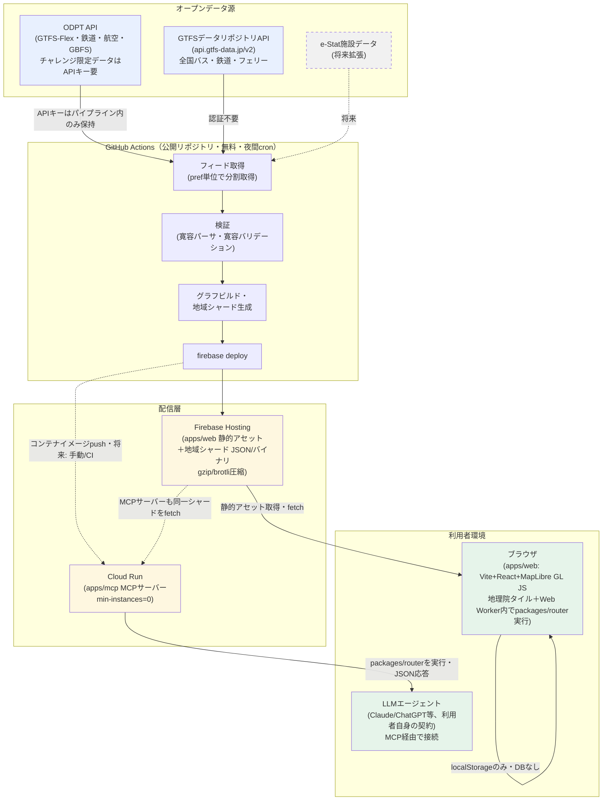
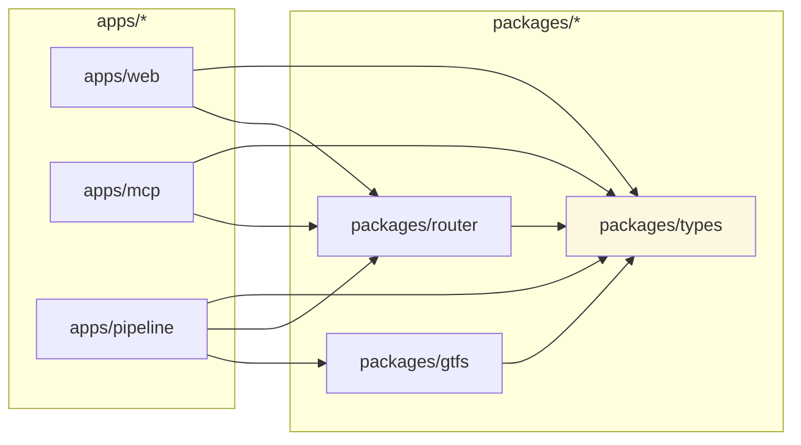
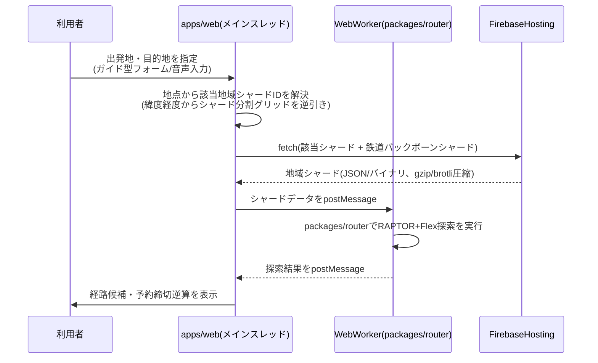
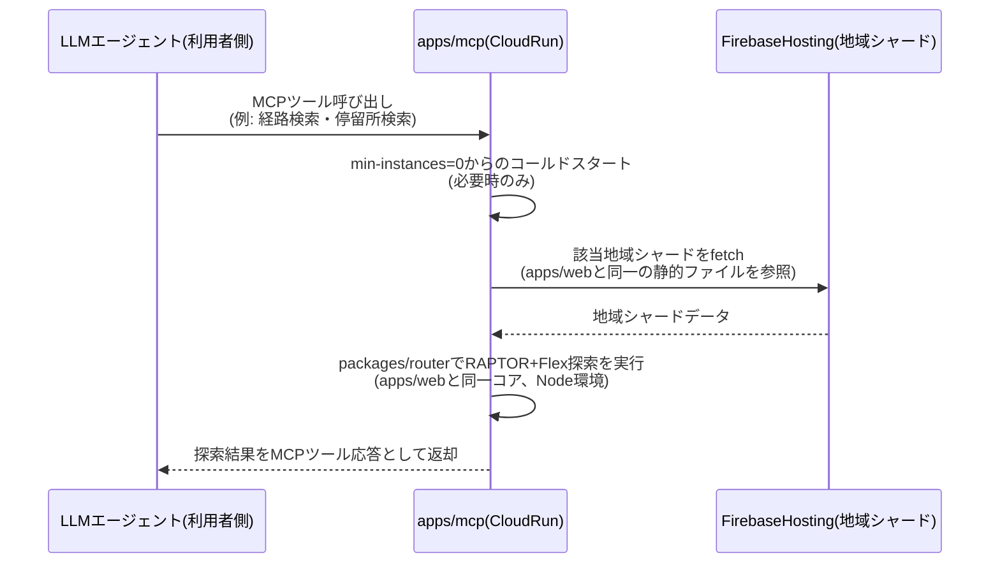

# システムアーキテクチャ設計書 — ノリシロ

**状態: 完了（設計確定。W3成果物）**
**作成日: 2026-07-02**
**対象読者: 実装を担当するClaude Code（VSCode）／レビューを行う開発者**

本書は`08_作業計画_WBS.md`のW3（`docs/11_アーキテクチャ設計.md`）に対応する成果物であり、ユーザーが確定した設計判断を正典として体系化・肉付けしたものである。設計判断そのものの変更・追加提案は行わず、別途「7. 代替案と不採用理由」節に分離して記載する。本書はネットワーク調査を伴わず、既存資料（`06_合体案_ノリシロxMCP_低コスト構成.md`、`08_作業計画_WBS.md`、`09_固定路線データ調査.md`、`10_GTFS-Flex実装仕様.md`）との整合を取ることに専念する。

`08_作業計画_WBS.md`が示す全体計画では、本書はI-1（リポジトリ初期化）・I-5（MVP公開）・I-6（全国化）・I-7（MCPサーバー公開）の実装フェーズが直接参照する設計書として位置づけられる。ルーティングアルゴリズムの詳細（RAPTOR本体・Flex拡張の疑似コード）は`10_GTFS-Flex実装仕様.md`（パーサ仕様＋ルーティング解釈）および今後作成される`13_ルーティングエンジン設計.md`（W5）の管轄であり、本書はそれらを「どこで・どう動かすか」という実行時アーキテクチャの観点でのみ扱う。

---

## 目次

1. [全体構成図](#1-全体構成図)
2. [モノレポ構成とパッケージ責務](#2-モノレポ構成とパッケージ責務)
3. [実行時アーキテクチャ](#3-実行時アーキテクチャ)
4. [GCPリソース一覧と無料枠試算表](#4-gcpリソース一覧と無料枠試算表)
5. [セキュリティ・キー管理方針](#5-セキュリティキー管理方針)
6. [非機能要件](#6-非機能要件)
7. [代替案と不採用理由](#7-代替案と不採用理由)
8. [未決事項リスト](#8-未決事項リスト)

---

## 1. 全体構成図

データは「オープンデータ源 → GitHub Actions（夜間cron） → Firebase Hosting / Cloud Run → ブラウザ／LLMエージェント」という一方向の流れで静的化・配信される。データベースは一切持たず、全ての経路探索用データは事前計算済みの静的ファイル（地域シャード）としてCDN配信される。

**図の読み方の補足**:

- 実線は確定済みの本番経路、破線は将来拡張または非同期・手動の経路を示す。
- ブラウザとCloud Run（MCPサーバー）はいずれも同一の`packages/router`を実行する「同一コアを2つの口から公開する」構成（`06_合体案`のエンジン層方針を継承）。ルーティング計算そのものはどちらの経路でもサーバー側のLLM推論を経由しない。
- データベースは図中に存在しない。地域シャードはFirebase HostingがCDNとして配信する静的ファイルであり、MCPサーバー（Cloud Run）もこのシャードをfetchして`packages/router`に読み込ませる（3.2節で詳述）。
- ODPTのAPIキーが必要なデータはGitHub Actions内（`FETCH`ステップ）でのみ使用され、静的化された後のシャードにはキーは含まれない（5章参照）。

---

## 2. モノレポ構成とパッケージ責務

言語はTypeScriptで統一し、pnpmモノレポとして構成する。

| ディレクトリ | 責務 | 主な技術要素 |
|---|---|---|
| `packages/types` | 共有型定義（GTFS Raw/Normalized型、Flex型、探索結果型等） | 純粋TypeScript型のみ。実行コードを持たない |
| `packages/gtfs` | GTFS/GTFS-Flexパーサ。Raw層（全列optional・値は文字列のまま）とNormalized層（型変換・検証・欠損補完済み）の2層構成（`10_GTFS-Flex実装仕様.md` 4.3節準拠） | 環境非依存の純粋TS。CSVパーサ（RFC4180準拠）、GeoJSONパーサ |
| `packages/router` | RAPTORベースの経路探索コア＋Flex仮想レッグ拡張（`10_GTFS-Flex実装仕様.md` 3章のaccess/egress/transfer統合方針に準拠）。ブラウザとNode両対応の環境非依存な純粋TS | RAPTORアルゴリズム、`DurationEstimator`インターフェース（既定実装はHaversine推定） |
| `apps/web` | Webアプリ本体。Vite＋React＋MapLibre GL JS＋地理院タイル。ルーティング計算はWeb Worker内で`packages/router`を実行し、サーバーへの探索リクエストを発生させない | Vite, React, MapLibre GL JS, Web Worker, Web Speech API（音声入力、`06_合体案`のガイド型UI方針） |
| `apps/mcp` | MCPサーバー。公式TypeScript SDK使用、Streamable HTTPで提供。同じ`packages/router`を使い、探索アルゴリズム自体をサーバー側とクライアント側で二重実装しない | `@modelcontextprotocol/sdk`, Node.js, Cloud Run上で稼働 |
| `apps/pipeline` | データ取り込み・グラフビルド・地域シャード生成のNodeスクリプト群。GitHub Actionsから起動される | Node.js, `packages/gtfs`（パース）, `packages/router`と共有するグラフ構造の事前計算ロジック |

### 依存方向

**依存ルール（厳格）**:

- `apps/*` は `packages/*` に依存できる（逆方向は禁止）。
- `packages/*` 同士は、`packages/types` 以外への相互依存を**禁止**する。すなわち `packages/router` は `packages/gtfs` に依存しない。RAPTORのグラフ構造は`packages/gtfs`が出力するNormalized層の型を経由せず、`packages/types`で定義される中間グラフ表現（探索用ノード・エッジ）を介して`packages/router`に渡される。
- この分離により、`packages/router`は「GTFSというデータ形式を知らない、探索アルゴリズムに徹する」モジュールとなり、`06_合体案`の「頭脳はアルゴリズム」という方針を型レベルでも表現する。また、パーサ（`packages/gtfs`）の変更がルーティングコア（`packages/router`）のブラウザ／Node両対応の環境非依存性に影響しないことを保証する。
- `packages/gtfs`と`packages/router`のグルーイング（GTFSデータをグラフに変換する処理）は`apps/pipeline`が担う。これによりグラフ変換ロジックはビルド時（GitHub Actions内）に閉じ込められ、実行時（ブラウザ／Cloud Run）は変換済みのグラフ表現を読み込むだけで済む。

---

## 3. 実行時アーキテクチャ

### (a) Webアプリ経路

**シャードのロード戦略**:

- 検索地点（出発地・目的地の緯度経度）を都道府県または地域単位のシャードIDに変換し、該当する地域シャード（数MB以内）と、広域移動をカバーする鉄道・航空のみの軽量バックボーングラフ（`06_合体案`が示す「広域移動は鉄道・航空のみの軽量バックボーングラフで接続」方針）を`fetch`する。
- 出発地・目的地が異なる地域シャードに属する場合は両方のシャード＋バックボーングラフを取得し、Worker内で結合してから探索する。
- 探索計算自体はメインスレッドをブロックしないよう必ずWeb Worker内で`packages/router`を実行する。サーバーへの探索リクエストは発生しない（サーバー不要の原則）。

**オフライン動作**:

- 一度fetchした地域シャードはService Worker（Vite PWAプラグイン等を想定）でキャッシュし、再訪問時・オフライン時は再フェッチせずにキャッシュ済みシャードを使う。
- 地図タイル（地理院タイル）についても同様にキャッシュ戦略を設け、既に閲覧した範囲はオフラインでも表示可能にする。
- オフライン時に新しい地域のシャードが必要な場合（キャッシュ未取得の地域への検索）は、探索不能であることをUIで明示し、オンライン復帰を促す。

### (b) MCP経路

- Cloud Run上のMCPサーバーは、Webアプリと**同一の`packages/router`**をNode環境で実行する。探索アルゴリズムの実装を二重に持たない（2章の依存方向ルールが保証する構成）。
- MCPサーバーが参照する地域シャードは、Firebase Hostingが配信するのと同じ静的ファイル群である。MCPサーバー専用の別データストアは持たない（データベースを持たないという確定判断の帰結）。
- MCPサーバー自体はLLM推論を一切行わない（`06_合体案`の「頭脳はアルゴリズム、LLMはただの入り口」方針）。推論コストは接続してきた利用者自身のLLM契約側で発生し、開発者側のLLM推論コストは0円である。
- Cloud Runはmin-instances=0のスケールtoゼロ構成とし、リクエストが無い間は課金対象インスタンスを維持しない。認証なしで公開し、簡易レート制限を設ける（4章・5章参照）。

---

## 4. GCPリソース一覧と無料枠試算表

| サービス | 無料枠 | 想定使用量 | 超過リスク | 防御策 |
|---|---|---|---|---|
| **Firebase Hosting** | ストレージ10GB、転送量360MB/日 | apps/web静的アセット（数MB）＋地域シャード群（1地域数MB以内目標、gzip/brotli圧縮前提）。全国分のシャード総量はストレージ10GBに対して余裕を持たせる設計とするが、シャード数・粒度の最終決定はW4（`12_データパイプライン設計.md`）で行う | 転送量360MB/日は、アクセスが集中した場合（審査期間・デモ動画公開直後等）に超過しやすい。1回のセッションで複数地域シャード＋バックボーングラフ＋地図タイルをfetchするため、利用者数×平均転送量で容易に日次上限へ近づく | CDNキャッシュ効率化を優先する（Service Workerでのクライアントキャッシュ、Firebase HostingのCache-Controlヘッダ最適化による再訪問時の転送量削減）。転送超過時に自動でサービスを縮退させるのではなく、キャッシュ効率化で防御する方針（確定判断8） |
| **Cloud Run（apps/mcp）** | 無料枠内（リクエスト数・CPU時間・メモリ・アウトバウンド通信の無料枠、月次）。min-instances=0でアイドル時課金なし | MCPサーバーへのツール呼び出し。認証なし公開のため呼び出し元はLLMエージェント経由の不特定利用者。呼び出し頻度はMVP期間中は少数、公開後の伸びは未知数 | 認証なし公開＋レート制限なしの状態で悪用・過剰リクエストを受けた場合、無料枠のリクエスト数上限を超過し課金が発生する。max-instances未設定の場合はスケールアウトにより同時実行数・課金が急増するリスクもある | Cloud Runの最大インスタンス数制限（max-instances）を設定し同時実行数の上限を明示する（確定判断8）。簡易レート制限（IPベース等）をアプリケーション層に実装する。GCP予算アラート（月100円で通知、確定判断8）で早期検知する |
| **GitHub Actions（apps/pipeline）** | 公開リポジトリでは無料（無制限に近い実行時間） | 夜間cronでのフィード取得（ODPT API・GTFSデータリポジトリAPI）→検証→シャードビルド→firebase deploy。全国565件以上のGTFSフィード（`09_固定路線データ調査.md` 5.2節）を都道府県単位で分割取得する設計 | 公開リポジトリである前提が崩れる（プライベート化）と無料枠の実行時間上限に切り替わり、全国規模のフィード取得・ビルド処理時間次第で超過する可能性がある | リポジトリを公開のまま維持する。チャレンジ限定データのAPIキーはGitHub Secretsで管理し、公開リポジトリでもキーが漏洩しない構成にする（5章参照）。ビルド処理は差分検出（`file_last_updated_at`比較、`09_固定路線データ調査.md` 6.2節）で不要な再ビルドを避け、実行時間を抑える |
| **GCP予算アラート** | 無料（Billingの機能） | 月100円のしきい値で通知を設定し、Cloud Run等の課金が発生した際に即座に検知する（確定判断8） | アラート自体に費用超過を止める強制力はなく、通知後の対応が遅れれば課金は継続する | 通知先を開発者が即座に確認できるチャネル（メール等）に設定する。恒常的な監視はせず、アラート発火を起点に4章の各防御策（max-instances見直し、レート制限強化等）を手動適用する運用とする |

**試算の位置づけに関する注記**: 本表はGCP無料枠の枠自体と防御策を確定するものであり、具体的な数値シミュレーション（想定PV数から転送量を逆算する等）は本書のスコープ外とする。シャードサイズの最終設計（分割粒度・圧縮後サイズの実測値）はW4（`12_データパイプライン設計.md`）で確定し、その値を用いて転送量試算を再検証することを未決事項（8章）とする。

---

## 5. セキュリティ・キー管理方針

- **ODPTのAPIキー類はクライアントに一切埋め込まない**（確定判断7）。ブラウザ（apps/web）・Cloud Run上のMCPサーバー（apps/mcp）はいずれもAPIキーを保持せず、参照するのは事前計算済みの静的シャードのみである。
- **チャレンジ限定データを含むフィード取得はすべてapps/pipeline（GitHub Actions内）で行う**。ODPT APIキーが必要なデータはパイプライン内で取得し、シャードビルドの時点で静的ファイルに変換する。静的化された後のシャードにAPIキーやチャレンジ限定データの出典を特定できる認証情報は含まれない。
- **APIキーの保管場所はGitHub Secrets**（確定判断4）。GitHub Actionsのワークフロー実行時にのみ環境変数として展開され、リポジトリのコード・コミット履歴・ビルド成果物（シャード）には残らない。
- **MCPサーバー（Cloud Run）は認証なしで公開する**（確定判断3）。これは「世界中のLLMエージェントが接続できる」という`06_合体案`のエコシステム貢献方針に基づく意図的な設計判断であり、認証なし＝無防備ではなく、4章の簡易レート制限・max-instances制限による防御と対をなす。
- **ライセンス・クレジット表記の管理**: `09_固定路線データ調査.md`が指摘する通り、フィードごとにライセンス（CC BY 4.0／公共交通オープンデータ基本ライセンス／チャレンジ限定ライセンス）が異なる。これはセキュリティ上の秘匿情報管理とは別軸だが、パイプラインのシャードビルド時にライセンスIDをメタデータとして保持し、UI表示・二次利用時のクレジット表記を動的に生成する設計とする（`09_固定路線データ調査.md` 7.3節を継承）。チャレンジ限定ライセンスのデータはコンテスト終了後の継続運用を前提としないため、差し替え可能な設計（フィード追加が設定ベースで行える汎用実装、`06_合体案`のリスク対策を継承）とする。
- **利用者データの扱い**: データベースを持たない構成（確定判断5）のため、利用者の検索履歴・設定はサーバーに送信・保存されない。すべてlocalStorageに閉じる。これにより利用者個人情報の漏洩リスクはサーバー側に存在しない。

---

## 6. 非機能要件

### 探索応答目標

| シナリオ | 目標応答時間 | 内訳の考え方 |
|---|---|---|
| 初回検索（シャード未キャッシュ） | 3秒以内 | 地域シャード＋バックボーングラフのfetch（CDN配信）＋Worker内RAPTOR+Flex探索の合計 |
| 再検索（シャードキャッシュ済み） | 500ミリ秒以内 | Service Worker等でキャッシュ済みのシャードを再利用し、fetchを伴わずWorker内探索のみで応答 |

### シャードサイズ予算

- 1地域あたり数MB以内（gzip/brotli圧縮後）を目標とする（確定判断2）。この目標値は3秒以内の初回応答目標を満たすための前提であり、実測値による検証と最終的な分割粒度の確定はW4（未決事項、8章）に持ち越す。
- 鉄道・航空のみの広域バックボーングラフは、全地域シャードと比べて軽量である前提（`06_合体案`）を維持し、複数地域をまたぐ検索でも合計転送量が3秒以内の目標を崩さないようにする。

### 対応ブラウザ

- MapLibre GL JS・Web Worker・Web Speech API・Service Worker（オフラインキャッシュ）を利用するため、これらAPIをサポートする最新のEvergreenブラウザ（Chrome, Edge, Firefox, Safari の直近バージョン）を対象とする。
- Web Speech API（音声入力）はブラウザ実装差があるため、非対応ブラウザではガイド型フォーム入力にグレースフルデグレードする（`06_合体案`の「高齢者にはチャットより分かりやすい」というガイド型フロー方針が、音声非対応環境でも代替手段として機能する）。

---

## 7. 代替案と不採用理由

本節は確定済み設計判断そのものではなく、検討の過程で不採用となった代替案を整理する。`06_合体案_ノリシロxMCP_低コスト構成.md`の経緯と整合させる。

| 代替案 | 検討内容 | 不採用理由 |
|---|---|---|
| **Oracle Cloud Always Free VM上でのサーバーサイド実行**（`06_合体案`の案B） | RAM 24GBのAlways FreeインスタンスでOpenTripPlanner 2または自前エンジンを稼働させ、全国グラフをメモリに載せて1台のサーバーで探索処理を行う構成 | (1) サーバーを持つ運用は「データベースを持たない・全て静的ファイル」という確定判断5と整合しない。(2) 単一VMの可用性・運用負荷（OSアップデート、プロセス監視等）がFirebase Hosting＋Cloud Runの管理不要なマネージドサービス構成に比べて重い。(3) Webアプリ側の探索をWeb Worker内クライアント実行にする方針（サーバー不要の原則）を取ったことで、そもそもサーバーサイドで全国グラフを保持する必要性自体が薄れた |
| **OpenTripPlanner 2（OTP2）サーバーでのFlex対応**（`06_合体案`の案B） | OTP2のGTFS-Flex v2部分対応を活用し、既存OSSルーティングエンジンをそのまま利用する構成 | `06_合体案`のリスク節に記載の通り「OTP2のFlex対応が不十分な場合」への対策として自前エンジン（案A）が既に選ばれている。加えてOTP2はJVMベースのサーバープロセスを要し、TypeScript統一（確定判断1）およびブラウザ内Worker実行という実行時アーキテクチャと相性が悪い。自前RAPTOR実装（`packages/router`）を採用することで、`10_GTFS-Flex実装仕様.md`が定めるFlexレッグのRAPTOR統合方針（access/egress/transfer拡張）を仕様レベルで完全に制御できる利点も上回った |
| **Rust/Go実装からWASM化**（`06_合体案`の案A原案） | ルーティングコアをRust/GoでネイティブAOTコンパイルし、WASMとしてブラウザで実行する構成。「ブラウザだけで動くオフライン対応Flexルーター」という技術的な見せ場を狙う案 | 確定判断1「言語はTypeScript統一」により、パーサ（packages/gtfs）とルーティングコア（packages/router）を含む全域が純粋TypeScriptで実装される。WASM化による実行速度上の優位はあるが、TS統一によりモノレポ全体（パーサ〜ルーター〜Web〜MCP〜パイプライン）で型定義（packages/types）を共有できる開発効率上のメリットと、Rust/Goとのビルドトゥールチェイン分離コストを比較し、TS統一を優先した。ブラウザ内Web Worker実行という「サーバー不要」の思想自体はWASM案からTS純粋実装案に引き継がれている |
| **サーバーサイドでの外部道路網ルーティングAPI連携**（`10_GTFS-Flex実装仕様.md` 3.2節の選択肢C） | Flexグループ内の2点間移動時間推定にOSRM・Google Maps Directions API等を用い、精度を高める案 | 低コスト制約（確定判断全体の前提）と相性が悪く、120停留所×119通りのような多数ペアへのAPI呼び出しはコスト・レイテンシの両面で不利。`10_GTFS-Flex実装仕様.md`が示す通りHaversine距離×迂回係数×平均速度による推定（選択肢A）を既定実装とし、`DurationEstimator`インターフェースとして将来の差し替え余地のみ残す設計とした |
| **MCPサーバーをCloudflare Workers無料枠で運用**（`06_合体案`のコスト見積り表に記載の初期案） | LLM推論コストゼロの構成を検討する過程で、MCPサーバーの配置先としてCloudflare Workers無料枠も候補に挙がっていた | 確定判断3で「Cloud Run（min-instances=0のスケールto0、無料枠内）」が採用された。GCPの他リソース（Firebase Hosting、GitHub Actions経由のfirebase deploy）と運用主体・課金管理（予算アラート等、確定判断8）を統一できる利点を優先したための整理と考えられる。Cloudflare Workers案自体の技術的な不採用理由（Node.js APIの制約等）は本書のスコープでは検証していない |

---

## 8. 未決事項リスト

以下は本書の設計確定範囲外とし、後続のドキュメント・作業フェーズで決定する。

| # | 未決事項 | 決定予定 | 関連 |
|---|---|---|---|
| 1 | **地域シャードの最終分割粒度**（都道府県単位か、より細かい地域単位か、鉄道バックボーンとの境界線をどこに引くか） | W4（`12_データパイプライン設計.md`） | 4章のシャードサイズ予算、3章(a)のロード戦略 |
| 2 | **シャードサイズの実測値による予算再検証**（gzip/brotli圧縮後の実際のバイト数、全国合計ストレージ量のFirebase Hosting 10GB枠に対する余裕度） | W4 | 4章のFirebase Hosting無料枠試算 |
| 3 | **Cloud Runのレート制限の具体的な実装方式**（IPベース、トークンバケット等のアルゴリズム選定） | W6（`14_MCPサーバーAPI仕様.md`） | 3章(b)、5章 |
| 4 | **JR東日本（八高線含む）の静的GTFS時刻表の入手可否**（`09_固定路線データ調査.md`が指摘する重大な未確認事項。エントリー後にmembers-portal.odpt.org側での確認が必要） | チャレンジ2026エントリー後、早期 | 3章(a)のシャード内容、固定路線RAPTORの対象範囲全般 |
| 5 | **9自治体分のチャレンジ限定Flexデータの実際のデータパターン**（location_group型以外の混在有無。`10_GTFS-Flex実装仕様.md`が寛容パーサとして備えを推奨しているが実データでの検証は未了） | チャレンジ限定データ公開後 | packages/gtfsの寛容パーサ実装範囲 |
| 6 | **GitHub Actions夜間cronの具体的なスケジュール（実行時刻・頻度）と全国規模ビルドの実行時間見積り** | W4 | 4章のGitHub Actions無料枠試算 |
| 7 | **GTFS-RT対応（将来）のキャッシュ付きプロキシの具体的なTTL・実装場所の確定**（本書ではCloud Run上に15-30秒TTLのキャッシュ付きプロキシとして設計方針のみ記載、確定判断6） | MVP後の将来フェーズ | 3章(b)の拡張、4章のCloud Run枠 |
| 8 | **MCPサーバーのツール定義詳細（経路検索・停留所検索・予約情報取得等の具体的なスキーマ）** | W6（`14_MCPサーバーAPI仕様.md`） | 3章(b) |

---

## 参考文献

1. `06_合体案_ノリシロxMCP_低コスト構成.md` — 3層アーキテクチャ、地域シャーディング方針、低コスト構成の背景思想、コスト見積り、開発ロードマップの一次資料
2. `08_作業計画_WBS.md` — W3の位置づけ、実装フェーズ（I-1〜I-9）との対応関係
3. `09_固定路線データ調査.md` — 固定路線データの提供状況、全国展開時のフィード数規模感（565件以上）、ライセンス種別の混在、JR東日本データ欠落リスク
4. `10_GTFS-Flex実装仕様.md`（3章） — Flexレッグのaccess/egress/transfer統合方針、`DurationEstimator`インターフェース、寛容パーサのRaw/Normalized層分離設計
