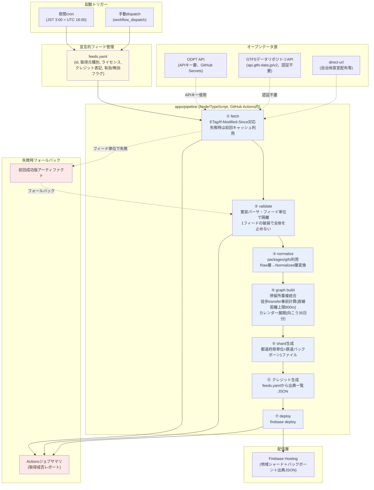
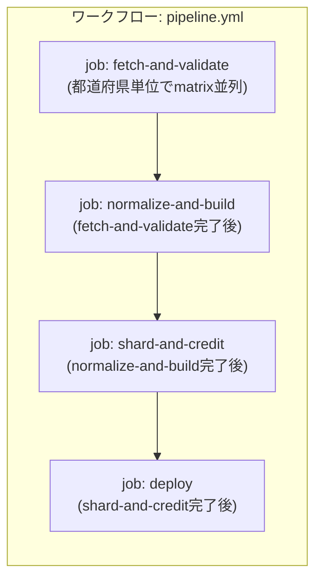

# データパイプライン設計書 — ノリシロ

**状態: 完了（設計確定。W4成果物）**
**作成日: 2026-07-02**
**対象読者: 実装を担当するClaude Code（VSCode）／レビューを行う開発者**

本書は`08_作業計画_WBS.md`のW4（`docs/12_データパイプライン設計.md`）に対応する成果物であり、ユーザーが確定した設計判断を正典として体系化・肉付けしたものである。設計判断そのものの変更・追加提案は行わず、別途「8. 代替案と未決事項」節に分離して記載する。本書はネットワーク調査を伴わず、既存資料（`09_固定路線データ調査.md`のGTFSデータリポジトリAPI仕様の実機調査結果・ライセンス注意、`11_アーキテクチャ設計.md`のapps/pipelineの位置づけ、`10_GTFS-Flex実装仕様.md`の寛容パーサ要件）との整合を取ることに専念する。

`08_作業計画_WBS.md`が示す全体計画では、本書はI-6（データパイプライン全国化＋地域シャーディング）が直接参照する設計書として位置づけられ、I-1（リポジトリ初期化）・I-3（ルーティングコア）・I-8（チャレンジ限定Flexデータ組み込み）にも関わる。パイプラインが生成するシャード形式は`packages/router`（RAPTOR＋Flex拡張、`10_GTFS-Flex実装仕様.md` 3章）が読み込む契約であり、本書の4章はその契約を規定する。ルーティングアルゴリズム本体の詳細実装は`13_ルーティングエンジン設計.md`（W5）の管轄であり、本書は「シャードとしてどう永続化し、どう配信するか」というビルド時アーキテクチャの観点でのみ扱う。

---

## 目次

1. [パイプライン全体図](#1-パイプライン全体図)
2. [feeds.yaml スキーマ定義と記入例](#2-feedsyaml-スキーマ定義と記入例)
3. [各ステージの入出力・処理内容・エラーポリシー](#3-各ステージの入出力処理内容エラーポリシー)
4. [シャード形式仕様](#4-シャード形式仕様)
5. [GitHub Actionsワークフロー設計](#5-github-actionsワークフロー設計)
6. [クレジット生成の仕様](#6-クレジット生成の仕様)
7. [更新・鮮度ポリシー](#7-更新鮮度ポリシー)
8. [代替案と未決事項](#8-代替案と未決事項)

---

## 1. パイプライン全体図

パイプラインは`apps/pipeline`（TypeScript/Node）として実装し、GitHub Actions上で夜間cron（JST 3:00）と手動dispatchの2系統から起動される。全ステージは単一のワークフロー内で直列に接続され、各ステージはフィード単位・都道府県単位で内部的に並列処理可能な設計とする（5章で詳述）。



**図の読み方の補足**:

- 実線は各ステージ間の正常時データフロー、破線はトリガー起点・外部データ源からの取得・失敗時フォールバック経路を示す。
- `feeds.yaml`は全ステージの起点であり、fetchステージが読み込む唯一の設定入力である。フィードの追加・無効化・差し替えは`feeds.yaml`の編集のみで完結し、パイプラインのコード変更を要しない（確定判断2の「チャレンジ限定Flexデータも同じ仕組みで追加・差し替え可能にする」を実現する構造）。
- validateステージの「フィード単位で隔離」は、1フィードのパースエラーが後続ステージ全体を停止させないことを意味する。壊れたフィードは`skipped`として記録され、そのフィード分のシャードだけが前回成功版から更新されない（3.2節で詳述）。
- クレジット生成（⑥）はshard生成（⑤）と並列に走らせても支障はないが、依存関係を単純にするため本図では直列に配置している（5章のジョブ分割では並列化を検討する）。
- deploy（⑦）が失敗した場合、Firebase Hosting上の既存配信内容は変更されない（firebase deployのアトミック性に依拠）ため、フォールバックの主戦場はfetch〜graph buildの間で発生するフィード単位の欠損である。

---

## 2. feeds.yaml スキーマ定義と記入例

### 2.1 設計方針

`feeds.yaml`は、パイプラインが取り込む全フィードを宣言的に列挙する単一の設定ファイルである。フィードの追加・無効化・差し替えは本ファイルの編集のみで行い、パイプラインのコード（`apps/pipeline`のTypeScript本体）は変更しない。これにより以下を実現する。

- **チャレンジ限定Flexデータの扱い**: 大会後にアクセス不能となるリスク（`06_合体案`・`09_固定路線データ調査.md` 6.3節が指摘）に対し、該当フィードの`enabled: false`への切り替え、またはエントリ自体の削除のみで対応できる。データ取得元が変わった場合（例: 一般公開への移行、URL変更）も`source`ブロックの書き換えのみで対応する。
- **取得元種別の抽象化**: `09_固定路線データ調査.md`が確認した2つの取得経路（GTFSデータリポジトリAPI、ODPT/CKAN）に加え、自治体が直接配布するURL（direct-url、例: 都営バスの`https://api-public.odpt.org/api/v4/files/...`のような直接ZIP URL）を同一スキーマで扱う。
- **ライセンス・クレジットのデータモデル内包**: `09_固定路線データ調査.md` 6.3節が指摘する「フィードごとにライセンスが異なる（CC BY 4.0／公共交通オープンデータ基本ライセンス／チャレンジ限定ライセンス）」実態を吸収し、6章のクレジット自動生成の入力データとする。

### 2.2 トップレベル構造

```yaml
# feeds.yaml
version: 1                      # スキーマバージョン。破壊的変更時にインクリメント

defaults:                       # 各フィードエントリで省略した場合のデフォルト値
  fetch:
    timeoutMs: 30000
    retries: 2
  validate:
    strict: false                # true にすると寛容パーサの警告をエラー扱いに昇格（デバッグ用）

feeds:
  - id: <string>                 # フィード一意識別子。シャード生成・キャッシュキー・ログ・クレジット表示の全てで使う主キー
    enabled: <boolean>            # false ならfetch以降の全ステージでスキップ（前回シャードには一切影響しない）
    kind: <"fixed-route" | "gtfs-flex">  # 固定路線かFlexかで後続のnormalize/graph buildの処理分岐を切る
    prefecture: <string>          # シャード分割の単位。JIS X 0401都道府県コード2桁文字列（例: "13"=東京都）。鉄道バックボーンに属す場合は "backbone" を指定
    source:                       # 取得元定義（2.3節でtype別に詳述）
      type: <"gtfs-data-jp" | "odpt" | "direct-url">
      # type別の追加フィールドは2.3節参照
    license:
      id: <string>                 # 例: "CC BY 4.0", "PTODBL"(公共交通オープンデータ基本ライセンス), "PTODCLL"(チャレンジ限定ライセンス)
      url: <string | null>         # ライセンス条文URL
      challengeLimited: <boolean>  # true ならチャレンジ限定データ。大会後非公開化を前提とした特別扱い(7章参照)
    credit:
      providerName: <string>       # クレジット表記に使う提供者名（事業者名の正式名称）
      creditText: <string>          # クレジット表記文字列そのもの（ライセンスが指定するテンプレートに沿って事前生成）
      sourceUrl: <string | null>    # 出典ページURL（CKAN/gtfs-data.jp検索ページ等）
    notes: <string | null>          # 自由記述。状態未確認等の注記に使う
```

### 2.3 `source.type`別の追加フィールド

| type | 追加フィールド | 用途 |
|---|---|---|
| `gtfs-data-jp` | `organizationId`, `feedId` | `https://api.gtfs-data.jp/v2/organizations/{organizationId}/feeds/{feedId}`を組み立てる（`09_固定路線データ調査.md` 6.1節のエンドポイント仕様に準拠）。ZIP本体は`.../files/feed.zip`から取得し、`file_uid`で版を識別する（同節「実機で確認された仕様書との差異」: `file_rid`は`not_implemented_yet`のため使用しない） |
| `odpt` | `datasetUrl`, `requiresApiKey` | CKANリソースURL、またはODPT API（`api.odpt.org`/`api-public.odpt.org`）のURL。`requiresApiKey: true`の場合、fetchステージでGitHub Secretsの`ODPT_API_KEY`をヘッダまたはクエリパラメータとして付与する |
| `direct-url` | `url` | 自治体・事業者が直接公開するZIP/JSON URL（例: 都営バスGTFSの`https://api-public.odpt.org/api/v4/files/Toei/data/ToeiBus-GTFS.zip`のような無認証直接URL）。認証不要が前提。認証が必要な直接URLは`odpt`type扱いにするか本スキーマの拡張を要する（8章未決事項） |

### 2.4 記入例

`09_固定路線データ調査.md` 2章の調査結果に基づき、瑞穂町Flex・都営バス・西武バス・瑞穂町コミバス・JR東日本（状態未確認プレースホルダ）の5件を記入する。

```yaml
version: 1

defaults:
  fetch:
    timeoutMs: 30000
    retries: 2
  validate:
    strict: false

feeds:
  # --- 瑞穂町GTFS-Flex「チョイソコみずほまち」---
  # 09_固定路線データ調査.md 2章: ODPT/CKANとGTFSデータリポジトリの両方に存在。
  # 本エントリはGTFSデータリポジトリ版(file_last_updated_at=2026-03-08)を正としているが、
  # 両者の版比較が未了(同ドキュメント8章の次のステップ2)のため要再確認。
  - id: mizuho-flex-demand
    enabled: true
    kind: gtfs-flex
    prefecture: "13"
    source:
      type: gtfs-data-jp
      organizationId: mizuhotown
      feedId: DemandResponsiveTransport
    license:
      id: "CC BY 4.0"
      url: "https://creativecommons.org/licenses/by/4.0/deed.ja"
      challengeLimited: false
    credit:
      providerName: "瑞穂町"
      creditText: "瑞穂町「チョイソコみずほまち」GTFS-Flexデータ（CC BY 4.0）を加工して作成"
      sourceUrl: "https://gtfs-data.jp/search?target_feed=mizuhotown*DemandResponsiveTransport"
    notes: "ODPT/CKAN版(20260202)とGTFSリポジトリ版(file_last_updated_at=2026-03-08)の内容比較は未了。09_固定路線データ調査.md 8章 次のステップ4参照。"

  # --- 瑞穂町コミュニティバス（固定路線）---
  # 09_固定路線データ調査.md 2章: 箱根ケ崎駅東口循環コースが2026年3月改正で新設、MVP圏最重要フィード。
  - id: mizuho-communitybus
    enabled: true
    kind: fixed-route
    prefecture: "13"
    source:
      type: gtfs-data-jp
      organizationId: mizuhotown
      feedId: communitybus
    license:
      id: "CC BY 4.0"
      url: "https://creativecommons.org/licenses/by/4.0/deed.ja"
      challengeLimited: false
    credit:
      providerName: "瑞穂町"
      creditText: "瑞穂町コミュニティバスGTFSデータ（CC BY 4.0）を加工して作成"
      sourceUrl: "https://gtfs-data.jp/search?target_feed=mizuhotown*communitybus"
    notes: "箱根ケ崎駅東口循環コース含む。停留所GeoJSON URLは09_固定路線データ調査.md調査時点で空レスポンス、要再調査。"

  # --- 都営バス（東京都交通局）---
  # 09_固定路線データ調査.md 2章: 梅70系統が個別に含まれるかは未確認(事業者全体を包含する1本のGTFS)。
  - id: toei-bus
    enabled: true
    kind: fixed-route
    prefecture: "13"
    source:
      type: direct-url
      url: "https://api-public.odpt.org/api/v4/files/Toei/data/ToeiBus-GTFS.zip"
    license:
      id: "CC BY 4.0"
      url: "https://creativecommons.org/licenses/by/4.0/deed.ja"
      challengeLimited: false
    credit:
      providerName: "東京都交通局"
      creditText: "東京都交通局「都営バスGTFS」（CC BY 4.0）を加工して作成"
      sourceUrl: "https://ckan.odpt.org/dataset/b_bus_gtfs_jp-toei"
    notes: "梅70系統が本GTFSに実際に含まれるかはroutes.txt未確認(09_固定路線データ調査.md 7.1節)。都バス全系統を包含する前提で取り込む。"

  # --- 西武バス ---
  # 09_固定路線データ調査.md 2章: 公共交通オープンデータ基本ライセンス(PTODBL)。特定利用条件未確認。
  - id: seibu-bus
    enabled: true
    kind: fixed-route
    prefecture: "13"
    source:
      type: odpt
      datasetUrl: "https://ckan.odpt.org/dataset/seibu_bus__b-bus_gtfs"
      requiresApiKey: false
    license:
      id: "PTODBL"
      url: "https://developer.odpt.org/terms"
      challengeLimited: false
    credit:
      providerName: "西武バス"
      creditText: "西武バス「西武バスGTFS」（公共交通オープンデータ基本ライセンス）を加工して作成"
      sourceUrl: "https://ckan.odpt.org/dataset/seibu_bus__b-bus_gtfs"
    notes: "公共交通オープンデータ基本ライセンスの特定利用条件は09_固定路線データ調査.md執筆時点で未確認(同ドキュメント8章 次のステップ5)。取り込み前にdeveloper.odpt.org/termsの内容確認が必要。箱根ケ崎駅発着系統が含まれるかも未確認。"

  # --- JR東日本（状態未確認プレースホルダ）---
  # 09_固定路線データ調査.md 4章: CKAN一般公開カタログ上jreast組織は0データセット。
  # 既存03_データセット一覧.mdの記述とCKAN実カタログが不一致。エントリー後の再確認が必要な重大未確認事項。
  - id: jreast-placeholder
    enabled: false
    kind: fixed-route
    prefecture: "13"
    source:
      type: odpt
      datasetUrl: "UNKNOWN"       # members-portal.odpt.org側での再確認待ち。09_固定路線データ調査.md 8章 次のステップ1
      requiresApiKey: true
    license:
      id: "UNKNOWN"
      url: null
      challengeLimited: true       # jre-is組織の運行情報・GTFS-RTはodpt-ptodcll(チャレンジ限定)。静的GTFS時刻表の有無自体が未確認のため保守的にtrue
    credit:
      providerName: "JR東日本"
      creditText: "UNKNOWN"
      sourceUrl: null
    notes: "状態未確認。CKAN一般公開カタログにjreast組織のデータセットは0件(09_固定路線データ調査.md 4章)。八高線を含む静的GTFS時刻表が確保できるかは11_アーキテクチャ設計.md 8章 未決事項4として管理中。enabled=falseのまま、確認完了後にsource/license/creditを実値で埋めてtrueに切り替える。"
```

**記入例の注記**: `jreast-placeholder`エントリは`enabled: false`のままパイプラインの対象フィード一覧に含めることで、「データが確保できていない」という状態自体を`feeds.yaml`上に明示し続ける。これにより、W3（`11_アーキテクチャ設計.md`）8章未決事項4の解消状況をコードレベルでも追跡できる（確認が取れた時点で`enabled: true`かつ実値を埋めるだけで組み込みが完了する）。

### 2.5 バリデーションルール（feeds.yaml自体に対する検査）

fetchステージ開始前に、`apps/pipeline`は`feeds.yaml`自体の構文・整合性を検査する。ここで検出された不整合は該当フィードを`skipped`として扱い、他フィードの処理は継続する（3.2節のフィード単位隔離方針を`feeds.yaml`の記述ミスにも適用する）。

- `id`はファイル全体でユニークであること（重複時は両方を`skipped`とし、ジョブサマリに警告を出す）。
- `license.challengeLimited: true`のフィードは、`notes`欄への注記を推奨する（必須ではないが、レビュー時の見落とし防止）。
- `source.type`に応じた必須フィールド（2.3節）が欠けている場合、当該フィードを`skipped`とする。
- `enabled: false`のフィードは構文検査のみ行い、以降のステージには渡さない。

---

## 3. 各ステージの入出力・処理内容・エラーポリシー

### 3.1 fetch

| 項目 | 内容 |
|---|---|
| 入力 | `feeds.yaml`（`enabled: true`の各フィードエントリ） |
| 出力 | フィードごとの生データ（ZIP/JSON/GeoJSON）＋メタ情報（ETag、Last-Modified、取得日時、`file_uid`等の版識別子） |
| 処理内容 | 1) フィードごとにHTTP GETを実行。`gtfs-data-jp`typeは`file_uid`ベースで版を識別（`09_固定路線データ調査.md` 6.2節「実機で確認された仕様書との差異」の指摘に従い`file_rid`には依存しない）。2) 条件付きGET（`If-None-Match`/`If-Modified-Since`）を使い、変化がなければ304を受けて前回取得済みデータをそのまま次段に渡す（差分検出、同調査6.2節・7.2節が推奨する`file_last_updated_at`比較の実装手段）。3) `requiresApiKey: true`のフィードはGitHub Secretsの`ODPT_API_KEY`を付与 |
| 並列度 | フィード単位で並列実行可能。`gtfs-data-jp`typeは同調査6.1節の指摘（`pref`パラメータでの都道府県別分割取得が安全、全国一括はレスポンス切断のリスクあり）に従い、都道府県単位でバッチ化してAPI呼び出しレート・レスポンスサイズを抑える |
| エラーポリシー | フィード単位でタイムアウト（既定30秒、`feeds.yaml`の`defaults.fetch.timeoutMs`で上書き可）・リトライ（既定2回）を行う。全リトライ失敗時は**前回成功時に取得したキャッシュ（GitHub Actionsのartifact/cacheとして永続化）を使用**し、当該フィードを`stale`（鮮度低下）としてマークして後続ステージに渡す。キャッシュも存在しない（初回取得や新規フィードの初回失敗）場合のみ、当該フィードを`skipped`として以降のステージから除外する |

### 3.2 validate

| 項目 | 内容 |
|---|---|
| 入力 | fetchステージの出力（生データ＋メタ情報） |
| 出力 | フィードごとの検証結果（`ok` / `ok_with_warnings` / `skipped`）＋警告ログ一覧 |
| 処理内容 | `10_GTFS-Flex実装仕様.md` 4章の寛容パーサ要件をパイプラインレベルで適用する。具体的には: 1) BOM有無・列順・改行コード(CRLF/LF)・CSVエスケープの差異を許容してパース（同4.2節）。2) UTF-8でデコード失敗時はShift_JIS/CP932への再デコードをフォールバックとして試行（同4.4節）。3) Optionalファイルの欠如（`locations.geojson`なし、`booking_rules.txt`なし等）を正常系として扱う（同4.1節・4.4節）。4) 必須フィールド欠損（`trip_id`欠損行の破棄等）は警告ログに記録し処理は継続する（同4.3節の正規化フォールバックルールの適用開始点） |
| フィード単位の隔離（最重要） | 1フィードの検証失敗（パース例外、ZIP展開失敗、致命的な構造異常）が他フィードの処理に影響しないよう、フィードごとに独立した try-catch境界で処理する。**あるフィードが`skipped`になっても、他フィードは`normalize`ステージへ進む**。これは確定済み設計判断3「1フィードの破損で全体を止めない」を実現する中核ロジックである |
| エラーポリシー | 警告（寛容パーサが吸収可能な逸脱）は`ok_with_warnings`として記録し処理続行。致命的エラー（ZIP自体が開けない、必須ファイルが1つも存在しない等）はそのフィードのみ`skipped`とし、fetchステージのキャッシュフォールバックと同様に**前回成功版のシャード内容を維持**する（4章で詳述するシャードの部分更新の仕組み）。`defaults.validate.strict: true`時は警告もエラーとして扱う（デバッグ・CI強化用途） |

### 3.3 normalize

| 項目 | 内容 |
|---|---|
| 入力 | validateステージを通過したフィード（`ok`/`ok_with_warnings`）のRaw層データ |
| 出力 | `packages/gtfs`が定義するNormalized層データ（`10_GTFS-Flex実装仕様.md` 4.3節の型、例: `NormalizedStopTimeRow`） |
| 処理内容 | `packages/gtfs`（`11_アーキテクチャ設計.md` 2章で定義されるパッケージ）を呼び出し、Raw層→Normalized層の変換を行う。GTFS-Flexフィード（`kind: gtfs-flex`）は`location_group_id`/`location_id`の解決、`pickup_type`/`drop_off_type`の欠損補完（同4.3節のフォールバックルール1〜5）を経る。固定路線フィード（`kind: fixed-route`）は従来型のstop_times正規化（時刻パース、`calendar.txt`/`calendar_dates.txt`の運行日判定）を行う |
| エラーポリシー | 正規化関数自体は例外を投げない設計（`10_GTFS-Flex実装仕様.md` 4.3節「実装コード本体は欠損があるかもしれないという条件分岐を一切書かずに済む」の前提を保つ）。正規化過程で解決不能な参照（外部キー不整合等）が生じた行は、警告ログに記録の上、探索グラフの構築対象から除外する（4.3節フォールバックルール5と同様の扱い） |

### 3.4 graph build

| 項目 | 内容 |
|---|---|
| 入力 | normalizeステージの出力（全フィード分のNormalized層データ） |
| 出力 | フィードをまたいだ統合グラフ（停留所ノード、固定路線エッジ、Flex仮想エッジ、徒歩transferエッジ） |
| 処理内容 | 1) **停留所の重複統合**: 複数フィードにまたがる同一地点の停留所（例: 駅前のバス停が複数事業者のGTFSに別IDで登録されているケース）を、緯度経度の近接度と名称類似度で名寄せし、探索上は単一ノードとして扱う。2) **徒歩transfer事前計算**: 直線距離ベースで上限800mまでの停留所ペアを走査し、徒歩transferエッジとして事前計算する（Haversine距離を用いる。`10_GTFS-Flex実装仕様.md` 3.2節の`HaversineDurationEstimator`と同種の距離計算関数を共有する）。3) **カレンダー展開**: `calendar.txt`/`calendar_dates.txt`の曜日パターン・例外日を、実行日（ビルド実行日）から向こう35日分の具体的な運行日リストに展開し、シャードには展開済みの日付リストを格納する（実行時の`packages/router`が曜日ロジックを都度計算しなくて済むようにする事前計算）。4) Flexフィードについては`10_GTFS-Flex実装仕様.md` 3.1節のFlexLeg生成方針に従い、location_groupごとの仮想レッグの元となるデータ（停留所集合・時間窓・予約ルール参照）をグラフに組み込む（実際の120×119通りの全展開は行わず、4.2節で述べる遅延評価可能な表現でシャードに格納する） |
| エラーポリシー | 名寄せ・transfer計算・カレンダー展開のいずれも、フィード単位のデータ欠損（例: あるフィードに`calendar.txt`が無い）に対しては当該フィード分の運行日情報を「展開不能」として除外し、他フィードのグラフ構築は継続する。停留所重複統合で誤統合が疑われるケース（閾値付近の類似度）は統合せず別ノードとして残す安全側の判断を既定にする（誤統合による経路探索の破綻は、未統合による冗長ノードの残存より実害が大きいため） |

### 3.5 shard生成

| 項目 | 内容 |
|---|---|
| 入力 | graph buildステージの出力（統合グラフ） |
| 出力 | 都道府県単位シャード（バス・コミバス・Flex）＋全国鉄道バックボーン1ファイル（4章で形式を規定） |
| 処理内容 | 統合グラフを`feeds.yaml`の`prefecture`フィールドに基づき分割する。`prefecture: "backbone"`指定のフィード（鉄道等の広域移動データ）は都道府県シャードに含めず、単一のバックボーンファイルに集約する。シャードIDは抽象化された識別子（現状は都道府県コード文字列だが、将来メッシュ分割に移行できるよう、シャードID→地理的範囲の対応表を別途メタデータとして持つ設計とする） |
| サイズ予算チェック | 生成した各シャードのgzip圧縮後サイズを検証し、都道府県シャードは3MB以下、バックボーンは2MB以下を上限とする。超過した場合はビルドを失敗させず**警告としてジョブサマリに記録**し、超過したシャードについては前回成功版を維持するかそのまま採用するかを運用判断とする（8章未決事項に残す。v1では警告のみで採用を継続する方針を既定とする） |
| エラーポリシー | シャード生成自体が失敗した都道府県は、そのシャードのみ前回成功版アーティファクトを維持する（確定済み設計判断7の「前回成功版アーティファクトへ自動フォールバック」を都道府県シャード単位で適用する最小粒度）。全都道府県が同時に失敗する事態は想定せず、そのような場合はワークフロー全体を失敗させ、deployステージに進めない |

### 3.6 deploy

| 項目 | 内容 |
|---|---|
| 入力 | shard生成ステージの出力（都道府県シャード群＋バックボーン＋6章のクレジット出典JSON） |
| 出力 | Firebase Hosting上に配信された静的ファイル一式 |
| 処理内容 | `firebase deploy`コマンドを実行し、`apps/web`の静的アセットと共に全シャード・出典JSONをFirebase Hostingにアップロードする。Cache-Controlヘッダの設定（`11_アーキテクチャ設計.md` 4章が言及するCDNキャッシュ効率化）もこのステージで行う |
| エラーポリシー | `firebase deploy`が失敗した場合、Firebase Hosting側の既存配信内容はロールバックされず変更されない（firebase deployのアトミック性）。ワークフロー全体を失敗として終了し、ジョブサマリに失敗理由を記録する。次回実行（次の夜間cronまたは手動dispatch）で再試行される |

---

## 4. シャード形式仕様

本章は`packages/router`が読み込む契約として、シャードのJSONスキーマを規定する。v1では**圧縮JSON**を採用し、性能不足が判明した時点でバイナリ化を検討する（確定済み設計判断4）。

### 4.1 シャードの2種別

| 種別 | ファイル数 | 内容 | サイズ上限（gzip後） |
|---|---|---|---|
| 都道府県シャード | 都道府県ごとに1ファイル（v1は都道府県単位、将来メッシュ単位に移行可能） | 当該都道府県に属するバス・コミバス・Flexデータの停留所・路線・トリップ・停車時刻・Flex情報・域内徒歩transfer | 3MB以下 |
| 鉄道バックボーン | 全国で1ファイル | 全国の鉄道（駅・列車運行系統）を中心とした広域移動用の軽量グラフ。バスは含まない | 2MB以下 |

### 4.2 トップレベル構造

```typescript
interface Shard {
  meta: ShardMeta;
  stops: CompressedStops;
  routes: CompressedRoutes;
  trips: CompressedTrips;
  stopTimes: CompressedStopTimes;
  flex: FlexData | null;          // 鉄道バックボーンでは常にnull。都道府県シャードでも当該都道府県にFlexフィードが無ければnull
  transfers: CompressedTransfers;
}

interface ShardMeta {
  shardId: string;                 // 例: "13"(東京都) / "backbone"(鉄道バックボーン)。将来メッシュ分割時はメッシュコードに置き換え可能な抽象識別子
  shardKind: "prefecture" | "backbone";
  schemaVersion: 1;                 // 本章で規定するスキーマのバージョン。破壊的変更時にインクリメントし、packages/routerは未知バージョンを検出したらロードを拒否する
  generatedAt: string;              // ISO 8601。ビルド実行日時
  calendarWindow: { from: string; to: string }; // 3.4節「向こう35日分」のカレンダー展開範囲（YYYY-MM-DD）
  sourceFeedIds: string[];          // 本シャードに含まれるfeeds.yaml上のフィードid一覧。6章クレジット表示との対応付けに使う
  feedStatus: Record<string, "ok" | "ok_with_warnings" | "stale" | "skipped">; // フィードごとの取り込み状態。stale/skippedは前回成功版データを含んでいることを示す
}
```

### 4.3 stops / routes / trips / stopTimes の圧縮表現

RAPTORの実装効率とシャードサイズ予算（3MB/2MB）を両立するため、各配列は「列指向（column-oriented）」の圧縮表現を採る。個々のオブジェクト配列（row-oriented）ではなく、フィールドごとの配列（JSONの繰り返しキー名によるオーバーヘッドを削減する）とする。

```typescript
// 列指向表現: 同じインデックスiの各配列要素が「stop[i]」を構成する
interface CompressedStops {
  stopId: string[];                 // グローバル一意ID。フィード間の重複統合(3.4節)後のID
  stopName: string[];
  lat: number[];
  lon: number[];
  sourceFeedId: string[];           // どのフィード由来か(重複統合で複数フィード由来が1ノードに統合された場合は代表フィードidを入れ、統合元一覧はmergedFromに退避)
  mergedFrom?: (string[] | null)[]; // 重複統合で吸収された元stopIdの配列。統合が無ければnull
}

interface CompressedRoutes {
  routeId: string[];
  routeShortName: string[];
  routeLongName: string[];
  routeType: number[];              // GTFS routes.txt route_type準拠(0=路面電車,1=地下鉄,2=鉄道,3=バス...)
  sourceFeedId: string[];
}

interface CompressedTrips {
  tripId: string[];
  routeIdx: number[];                // CompressedRoutes配列内のインデックス参照(文字列IDの再掲によるサイズ増を避ける)
  serviceDates: string[][];          // 3.4節のカレンダー展開結果。向こう35日分の具体的なYYYY-MM-DD配列
  headsign: (string | null)[];
}

interface CompressedStopTimes {
  tripIdx: number[];                 // CompressedTrips配列内のインデックス参照
  stopSequence: number[];
  stopIdx: number[];                 // CompressedStops配列内のインデックス参照。Flexのlocation_group行はstopIdx=-1(4.4節のflexGroupIdxで参照)
  arrivalSec: (number | null)[];     // 当日0時からの秒数。null は時間窓方式(Flex)のため個別時刻を持たない行
  departureSec: (number | null)[];
  pickupType: number[];              // 0-3, 10_GTFS-Flex実装仕様.md 2.5.1節のEnum値
  dropOffType: number[];
}
```

**インデックス参照方式を採る理由**: 文字列IDをstopTimes配列内で毎行再掲すると、都道府県シャード全体でのJSON冗長性が大きくなる（`09_固定路線データ調査.md` 5.3節が指摘する「大都市圏事業者の全系統フィードは相対的にファイルサイズが大きくなる」規模感を踏まえ、都営バス・西武バスのような大規模フィードを内包する東京都シャードで特に効果が出る）。配列インデックス参照により、gzip圧縮前のペイロード自体を削減する。

### 4.4 Flexデータの持ち方

`10_GTFS-Flex実装仕様.md` 3.1節の`FlexLeg`インターフェースをシャード格納用に永続化表現へ落とし込む。120×119通りの全展開（同節が明示的に避けるべきとする方式）はシャードにも適用せず、**グループ単位の元データ**を格納し、`packages/router`側の探索時に個々の`FlexLeg`をオンデマンド生成する遅延評価方式を維持する。

```typescript
interface FlexData {
  locationGroups: CompressedLocationGroups;
  flexTrips: CompressedFlexTrips;
  bookingRules: CompressedBookingRules;
}

interface CompressedLocationGroups {
  locationGroupId: string[];
  locationGroupName: (string | null)[];
  memberStopIdx: number[][];          // CompressedStops配列内インデックスの配列。10_GTFS-Flex実装仕様.md 2.3節のlocation_group_stops.txt相当
}

interface CompressedFlexTrips {
  tripIdx: number[];                   // CompressedTrips配列内インデックス参照
  locationGroupIdx: number[];          // CompressedLocationGroups配列内インデックス参照
  windowStartSec: number[];            // start_pickup_drop_off_window、当日0時からの秒数
  windowEndSec: number[];
  pickupBookingRuleIdx: (number | null)[]; // CompressedBookingRules配列内インデックス参照
  dropOffBookingRuleIdx: (number | null)[];
  meanDurationFactor: (number | null)[];    // 10_GTFS-Flex実装仕様.md 2.5節。未提供フィードではnull
  meanDurationOffset: (number | null)[];
}

interface CompressedBookingRules {
  bookingRuleId: string[];
  bookingType: number[];                // 0/1/2、10_GTFS-Flex実装仕様.md 2.4.1節のEnum
  priorNoticeDurationMin: (number | null)[];
  priorNoticeDurationMax: (number | null)[];
  priorNoticeLastDay: (number | null)[];
  priorNoticeLastTime: (string | null)[]; // "HH:MM:SS"
  message: (string | null)[];
  phoneNumber: (string | null)[];
  infoUrl: (string | null)[];
}
```

**所要時間推定について**: `estimatedDurationSec`（`10_GTFS-Flex実装仕様.md` 3.1節の`FlexLeg`が持つフィールド）はシャードに事前計算値として格納せず、`meanDurationFactor`/`Offset`と停留所の緯度経度のみを格納し、`packages/router`実行時に`DurationEstimator`（同3.2節、既定は`HaversineDurationEstimator`）で都度算出する。理由: 120×119通りのペア全てを事前計算してシャードに含めると、大規模なlocation_groupを持つフィードでシャードサイズが不必要に増大するため、遅延評価によりシャードサイズを抑える（4.3節のインデックス参照方式と同じ「事前計算とオンデマンド計算の使い分け」思想）。

### 4.5 transfers（徒歩transfer）

```typescript
interface CompressedTransfers {
  fromStopIdx: number[];      // CompressedStops配列内インデックス参照
  toStopIdx: number[];
  distanceM: number[];        // Haversine直線距離（3.4節「直線距離ベース上限800m」）
  walkSec: number[];          // 事前計算済み徒歩時間（平均徒歩速度を用いて算出、係数はpackages/routerと共有する定数）
}
```

transferは対称（`fromStopIdx`→`toStopIdx`と逆方向は同じ`distanceM`/`walkSec`を持つ）だが、配列には両方向を明示的に2行として格納する（RAPTOR実装側でのルックアップを単純化するため、暗黙の対称性に依存させない）。

### 4.6 メタ情報とバージョニング

- `ShardMeta.schemaVersion`はシャード形式そのものの契約バージョンである。`packages/router`はロード時に`schemaVersion`を検査し、実装が対応しないバージョンのシャードを読み込んだ場合は例外を投げて処理を中断する（サイレントな誤動作を避ける）。
- `ShardMeta.sourceFeedIds`と`feeds.yaml`の`id`は1対1で対応し、6章のクレジット生成・7章の鮮度監視の両方でこの対応関係を使う。
- `ShardMeta.feedStatus`により、クライアント側（`apps/web`・`apps/mcp`）は「このシャードの一部データは前回成功版のまま更新されていない」ことを検出できる。v1ではUI上の明示的な警告表示までは実装範囲に含めない（8章未決事項）が、フィールド自体はv1スキーマに含めておく。

---

## 5. GitHub Actionsワークフロー設計

### 5.1 ジョブ分割



| ジョブ | 内容 | 並列化 |
|---|---|---|
| `fetch-and-validate` | fetch（3.1節）＋validate（3.2節）を都道府県単位のmatrix strategyで並列実行。GTFSデータリポジトリAPIの`pref`パラメータ分割取得（`09_固定路線データ調査.md` 6.1節）と自然に対応する単位 | 都道府県単位（最大47並列、GitHub Actionsのmatrix上限・同時実行数の枠内に収める） |
| `normalize-and-build` | normalize（3.3節）＋graph build（3.4節）。停留所重複統合はフィード間・都道府県間をまたぐ可能性があるため、全都道府県のfetch-and-validate完了を待って単一ジョブで実行 | 単一ジョブ内で処理。将来的に地域ブロック単位（関東・近畿等）に分割し部分並列化する余地は残す（8章未決事項） |
| `shard-and-credit` | shard生成（3.5節）＋クレジット生成（6章）。クレジット生成はfeeds.yamlのみに依存するため、shard生成と並列実行可能（依存関係が無いため） | shard生成は都道府県単位で並列化可能。クレジット生成は全フィード分を単一ステップで処理 |
| `deploy` | firebase deploy（3.6節） | 単一ジョブ |

### 5.2 キャッシュ戦略

| キャッシュ対象 | キー | 用途 |
|---|---|---|
| fetch結果（生データ） | `fetch-{feedId}-{etag または file_uid}` | ETag/If-Modified-Since対応の実体。GitHub Actions `actions/cache`で永続化し、304応答時はキャッシュヒットとして次段に渡す |
| 前回成功版シャード | `shard-{shardId}-last-success` | 3.1節・3.2節・3.5節で規定するフィード単位・シャード単位のフォールバック先。ビルド失敗時にこのキャッシュから復元する |
| node_modules / pnpmストア | 標準的なNode.jsセットアップアクションのキャッシュ機構 | ビルド時間短縮（データ取得とは無関係の一般的なCI高速化） |

**キャッシュの永続性に関する注意**: GitHub Actionsの`actions/cache`はアクセスされないキャッシュエントリを一定期間（既定7日、リポジトリ全体で10GB上限）で失効させる仕組みがあるため、「前回成功版シャード」のフォールバック先としては`actions/cache`だけでなく、**直近のFirebase Hosting配信内容そのもの**も実質的なフォールバック先として機能する（deployが失敗しない限り、Firebase Hosting上の内容は最後に成功したビルドの結果である）。両者を組み合わせることで、cronの実行間隔（1日）をまたいだ長期のフォールバックにも耐える。

### 5.3 Secrets

| Secret名 | 用途 | 付与範囲 |
|---|---|---|
| `ODPT_API_KEY` | `feeds.yaml`で`requiresApiKey: true`のフィード取得時にfetchステージが使用 | `fetch-and-validate`ジョブのみ |
| `FIREBASE_SERVICE_ACCOUNT` または `FIREBASE_TOKEN` | `firebase deploy`実行時の認証 | `deploy`ジョブのみ |

確定済み設計判断5（ODPT APIキーはGitHub Secrets、キー必要データはパイプラインで静的化しクライアントには渡さない）に従い、Secretsを参照するのは`fetch-and-validate`ジョブに限定する。以降のジョブ（normalize以降）はSecretsへのアクセス権を持たない構成とし、万一normalize以降のコードに脆弱性があってもAPIキー漏洩の経路にならないようにする。

### 5.4 所要時間概算

| ジョブ | 概算所要時間 | 概算根拠 |
|---|---|---|
| `fetch-and-validate`（都道府県単位、1並列あたり） | 数十秒〜数分 | `09_固定路線データ調査.md` 5.2節の規模感（全国565件以上、東京都9件・神奈川県7件、長野県46件以上等）を踏まえ、フィード数が多い都道府県ほど時間がかかる。差分検出（ETag/If-Modified-Since）が効くcron実行（2回目以降）は大半が304応答で高速化される想定。初回フルフェッチ時が最も時間を要する |
| `normalize-and-build`（単一ジョブ、全国分） | 数分〜十数分 | 停留所重複統合・徒歩transfer事前計算（800m以内ペア走査）が全国規模になるため、都道府県単位の並列ジョブより重い処理になる想定。実測値による見積り再検証は8章未決事項とする |
| `shard-and-credit` | 数分程度 | 都道府県単位のシャード書き出し＋gzip圧縮＋サイズ検証 |
| `deploy` | 数分程度 | `firebase deploy`のアップロード時間はシャード総量（都道府県シャード×47以下＋バックボーン1）に依存 |
| **合計** | **概算20〜40分程度（初回フルフェッチ時はこれより長い）** | 差分検出が効く定常運用（2回目以降の夜間cron）では上記より短縮される見込み。実測による確定は8章未決事項 |

### 5.5 無料枠との関係

- GitHub Actionsは公開リポジトリでは無料（`11_アーキテクチャ設計.md` 4章）であり、上記所要時間概算（1日1回、数十分程度）であれば無料枠の実行時間上限（公開リポジトリでは実質無制限）を懸念する必要はない。
- 唯一のリスクは`11_アーキテクチャ設計.md` 4章が指摘する「リポジトリのプライベート化」であり、公開リポジトリを維持する前提が崩れない限り本パイプラインの無料枠超過リスクは低い。
- matrix並列実行（都道府県単位、最大47）は同時実行数の上限（GitHub Actionsのプラン・組織設定に依存）に注意する。上限に達する場合はmatrixの`max-parallel`設定で同時実行数を制限し、キュー待ちで順次処理する運用に切り替える（8章未決事項）。

---

## 6. クレジット生成の仕様

確定済み設計判断6（クレジット自動生成）に対応する。応募規約・ライセンス遵守（`09_固定路線データ調査.md` 6.3節「全国取り込みパイプラインでは、フィード単位でライセンスIDを保持し、表示・二次利用時にライセンスごとのクレジット表記を動的に切り替える設計が必須」）を実現する必須機能である。

### 6.1 入力

`feeds.yaml`の`enabled: true`かつ`skipped`でない全フィードエントリ（`license`ブロック・`credit`ブロック）。

### 6.2 出力: 出典一覧JSON

```typescript
interface CreditManifest {
  generatedAt: string;               // ISO 8601
  entries: CreditEntry[];
}

interface CreditEntry {
  feedId: string;                     // feeds.yamlのid、ShardMeta.sourceFeedIdsと対応
  providerName: string;
  creditText: string;
  licenseId: string;
  licenseUrl: string | null;
  sourceUrl: string | null;
  challengeLimited: boolean;
  prefecture: string;                 // どの都道府県シャード/backboneに属するか
}
```

このJSONはshard生成と同じくFirebase Hostingにデプロイされる静的ファイル（例: `credits.json`）とし、Webアプリの「データ出典」ページ（`apps/web`側の実装、本書スコープ外）がこれを`fetch`して表示する。

### 6.3 生成ロジック

1. `feeds.yaml`の`credit.creditText`は事前に人手で（またはライセンステンプレートに従って半自動で）記入された文字列をそのまま採用する。パイプライン側で自動的に文言を生成するのではなく、`feeds.yaml`という宣言的設定に「すでに正しい文言が書かれている」ことを前提にする（確定済み設計判断2の宣言的管理方針に合わせ、クレジット文言自体もfeeds.yaml上でレビュー可能にする）。
2. `license.challengeLimited: true`のフィードも`CreditManifest`には含める（コンテスト応募規約が要求するクレジット表記は、限定データであっても免除されない）。ただし大会後にフィードが`enabled: false`へ切り替えられた場合は、次回ビルド以降のCreditManifestから自動的に除外される（`feeds.yaml`の単一の真実源としての性質がそのままクレジット表示にも反映される）。
3. ライセンスIDが`"UNKNOWN"`のプレースホルダエントリ（2.4節の`jreast-placeholder`のような`enabled: false`のフィード）は、そもそも`enabled: false`のためCreditManifestの生成対象に含まれない。

### 6.4 ライセンス種別ごとの注意事項の反映

`09_固定路線データ調査.md` 6.3節が指摘する以下の実態を、`feeds.yaml`の記入運用ルールとして反映する（パイプラインのコードロジックではなく、`feeds.yaml`記入時のレビュー観点として明文化する）。

- CC BY 4.0系（多数派）: 「コンテンツ等の提供者名」欄の値をそのまま`credit.creditText`に転記すればよい。
- 公共交通オープンデータ基本ライセンス（PTODBL）系（西武バス等）: CC BY 4.0より事業者ごとの追加条件が課される可能性があるため（同6.3節）、`developer.odpt.org/terms`の内容確認（`09_固定路線データ調査.md` 8章 次のステップ5、未確認事項）が完了するまで、当該フィードの`notes`に確認未了である旨を明記し続ける。
- チャレンジ限定ライセンス（PTODCLL）: コンテスト応募規約の「目的外利用・第三者提供の禁止」「データ提供はチャレンジ終了までの予定」（同6.3節、`01_開催概要_募集要項.md`）を踏まえ、`license.challengeLimited: true`のフラグを介して7章の鮮度ポリシーと連動させる（大会終了が近づいた場合の運用対応の起点とする）。

---

## 7. 更新・鮮度ポリシー

### 7.1 フィード鮮度の監視

- 各フィードの`file_last_updated_at`（`gtfs-data-jp`type）または取得時のHTTPレスポンスヘッダ（`Last-Modified`等、`odpt`/`direct-url`type）を、fetchステージの実行ごとに記録する。
- `09_固定路線データ調査.md` 6.1節・7.2節が指摘する通り、GTFSデータリポジトリAPI・ODPT側いずれも「次回いつ更新されるか」の公式な保証が得られていないため、鮮度監視は「前回取得時からの経過日数」と「実際に値が変化した頻度」の両方を記録し、経験的な更新間隔をログから学習的に把握する運用にする（同ドキュメント7.2節「ポーリング頻度は保守的に（例: 日次）設定し、`file_last_updated_at`の変化検出で実際の更新タイミングを学習的に把握する」を踏襲）。
- ジョブサマリ（5章・本節7.2）に、フィードごとの「前回取得からの経過日数」「直近30回の実行での変化検出回数」のような簡易統計を出力し、更新頻度が極端に低い（または高い）フィードを人手で把握できるようにする。

### 7.2 feed_info.txtの有効期限チェック

- GTFS標準の`feed_info.txt`が持つ`feed_start_date`/`feed_end_date`（フィードの有効期間）を、normalizeステージで抽出し、ShardMeta相当のビルド時メタデータとして記録する。
- `09_固定路線データ調査.md` 2章の実例（瑞穂町コミュニティバスの有効期間2024-10-01〜2027-03-31）のように、フィードには有効期限が明示されているケースが多い。ビルド実行日が`feed_end_date`に接近（例: 残り30日以内）した場合、ジョブサマリに警告として出力し、次版フィードへの切り替え・再確認が必要であることを人手に伝える。
- `feed_end_date`を過ぎたフィードは、fetch自体は継続する（提供元が新版に切り替えている可能性があるため取得を止めない）が、validateステージで「有効期限切れ」の警告を記録し、シャードには含めつつも`ShardMeta.feedStatus`上で区別できるようにする（v1では`ok_with_warnings`扱いとし、専用のステータス値追加は8章未決事項とする）。

### 7.3 ジョブサマリへの取得成否レポート出力

確定済み設計判断7の後半（「Actionsのジョブサマリに取得成否レポートを出力」）に対応する。GitHub Actionsのジョブサマリ機能（`$GITHUB_STEP_SUMMARY`）を用い、以下を1回の実行ごとに出力する。

```markdown
## パイプライン実行レポート — 2026-07-02 03:00 JST

### フィード取得状況
| フィードID | 状態 | 前回からの変化 | 鮮度（前回取得からの経過日数） |
|---|---|---|---|
| mizuho-flex-demand | ok | 変化なし(304) | 3日 |
| mizuho-communitybus | ok_with_warnings | 更新あり | 0日 |
| toei-bus | stale | 取得失敗、前回キャッシュ使用 | 8日 |
| seibu-bus | ok | 更新あり | 1日 |

### シャードサイズ
| シャードID | gzip後サイズ | 予算 | 判定 |
|---|---|---|---|
| 13(東京都) | 2.1MB | 3MB | OK |
| backbone | 1.8MB | 2MB | OK |

### feed_info有効期限アラート
- なし（30日以内に期限切れとなるフィードなし）

### 警告ログ抜粋
- mizuho-communitybus: stop_times.txt 3行でtrip_id欠損、警告の上除外
```

この形式により、パイプライン実行者（開発者）は毎回のActions実行結果画面から生データを掘らずに取得成否・鮮度・サイズ予算・警告の概況を即座に把握できる。

---

## 8. 代替案と未決事項

### 8.1 代替案（不採用・検討過程の整理）

本節は確定済み設計判断そのものではなく、検討の過程で不採用となった、または本書のスコープでは決定を下さなかった代替案を整理する。`11_アーキテクチャ設計.md` 7章の構成方針を継承する。

| 代替案 | 検討内容 | 不採用・保留理由 |
|---|---|---|
| **シャードのバイナリ形式（v1からの採用）** | Protocol Buffers、FlatBuffers、MessagePack等のバイナリシリアライゼーションをv1から採用し、JSON経由のオーバーヘッドを最初から排除する | 確定済み設計判断4が「v1では圧縮JSON、性能不足時にバイナリ化検討」と明示している。v1時点では実測サイズ・実測パース速度が未検証であり、開発速度（デバッグ時にJSONは`packages/router`実装者が目視確認しやすい）を優先し、バイナリ化は性能不足が実際に確認された段階に持ち越す判断が既に下されている。本書はこの判断を4章のスキーマ設計に反映し、バイナリ化自体は8.2節の未決事項として扱う |
| **`feeds.yaml`ではなくTypeScriptコード内でフィード定義を直接記述** | フィード一覧をYAMLではなくTSの配列リテラルとして`apps/pipeline`内に直接持つ案 | 確定済み設計判断2が宣言的管理（YAML）を明示している。TSコード内定義は型安全性の利点があるが、非開発者（自治体データ提供者との調整担当等）がフィード追加・無効化を行う際にコード変更・レビュー・デプロイが必要になり、`06_合体案`の「Flexフィードを設定で追加できる汎用実装」というリスク対策方針（大会後の非公開化対策）と整合しない |
| **停留所重複統合を都道府県単位のジョブ内で個別に実施** | 5.1節の`normalize-and-build`を都道府県単位で並列化し、統合処理も分割する案 | 重複統合（3.4節）は都道府県境をまたぐ停留所ペア（隣接県境のバス停等）を捉える必要があり、都道府県単位に分割すると境界をまたぐ統合を原理的に見逃す。本書では単一ジョブでの全国一括統合を採用したが、処理時間（5.4節「数分〜十数分」）が実測で許容範囲を超える場合、地域ブロック単位（関東・近畿等、県境をまたぐ統合が実務上少ないブロック分け）での準並列化を検討する余地を8.2節に残す |
| **GTFS-RTのリアルタイムデータをパイプラインに統合** | 静的GTFSに加え、GTFS-RT（VehiclePosition等）をfetchステージで取り込み、シャードにリアルタイム性のある情報を含める案 | `11_アーキテクチャ設計.md` 8章未決事項7が「GTFS-RT対応（将来）のキャッシュ付きプロキシ」をMVP後の将来フェーズとして位置づけている。本パイプラインは夜間cronの静的化処理であり、秒単位の更新が必要なGTFS-RTとはアーキテクチャ上の要求（TTL数十秒のキャッシュプロキシ）が異なるため、本書のスコープからは明確に除外する |
| **フィード取得元ごとに専用のfetcherパッケージを作る（`packages/fetcher-gtfs-data-jp`等）** | `source.type`ごとに独立したnpmパッケージへ分割し、`apps/pipeline`本体を薄く保つ案 | `11_アーキテクチャ設計.md` 2章の依存ルール（`packages/*`はpackages/types以外への相互依存禁止）はapps/pipelineには直接適用されないが、パッケージ分割の粒度自体は本書のスコープ外の実装詳細と判断し、`apps/pipeline`内のモジュール分割（ファイル・関数の切り方）に委ねる。取得元種別が将来的に増加した場合（8.2節）の再検討事項として残す |

### 8.2 未決事項リスト

以下は本書の設計確定範囲外とし、後続のドキュメント・実装フェーズで決定する。

| # | 未決事項 | 決定予定 | 関連 |
|---|---|---|---|
| 1 | **シャード実測サイズによるバイナリ化判断**（v1圧縮JSONのgzip後実測サイズが3MB/2MB予算内に収まるか。収まらない場合のバイナリ形式選定） | I-6実装時、実データでの初回ビルド後 | 4章シャード形式仕様、確定済み設計判断4 |
| 2 | **`normalize-and-build`の実測所要時間と地域ブロック分割の必要性判断**（5.4節の概算「数分〜十数分」の実測検証、GitHub Actions無料枠との整合） | I-6実装時 | 5.1節ジョブ分割、5.4節所要時間概算 |
| 3 | **シャードサイズ超過時の運用ルール確定**（3.5節で「v1では警告のみで採用を継続」としたが、恒常的な超過が発生した場合にビルドを失敗させるべきか、シャード分割粒度自体を見直すべきかの判断基準） | I-6実装後の運用観察を経て | 3.5節エラーポリシー、`11_アーキテクチャ設計.md` 8章未決事項1・2（シャード分割粒度） |
| 4 | **`feed_end_date`超過フィードの専用ステータス値の追加**（7.2節で`ok_with_warnings`に一時的に含めたが、`ShardMeta.feedStatus`に`expired`等の専用値を設けるかどうか） | W6（`14_MCPサーバーAPI仕様.md`）またはI-6実装時 | 4.6節・7.2節 |
| 5 | **`feeds.yaml`の`source.type`拡張（認証が必要なdirect-url等）**（2.3節で「認証が必要な直接URLは`odpt`type扱いにするか本スキーマの拡張を要する」と留保） | 実際に該当するフィードが判明した時点（例: JR東日本データの提供形態確定後） | 2.3節、`09_固定路線データ調査.md` 8章 次のステップ1（JR東日本データ再確認） |
| 6 | **matrix並列実行の`max-parallel`設定値**（5.5節、GitHub Actionsの同時実行数上限との調整） | I-6実装時、実際のフィード数確定後 | 5.1節・5.5節 |
| 7 | **「公共交通オープンデータ基本ライセンス」特定利用条件確認後のfeeds.yaml記入規則の確定**（西武バス等） | `09_固定路線データ調査.md` 8章 次のステップ5の解消後 | 6.4節、2.4節seibu-busエントリ |
| 8 | **JR東日本データの実際の取得可否確定後のfeeds.yaml本番エントリ化**（`jreast-placeholder`の実値化） | チャレンジ2026エントリー後、`11_アーキテクチャ設計.md` 8章未決事項4の解消後 | 2.4節jreast-placeholderエントリ |
| 9 | **同一フィードの複数チャネル重複公開時の名寄せ・優先順位ルール**（`09_固定路線データ調査.md`が指摘する瑞穂町FlexデータのODPT版/GTFSリポジトリ版の版比較、2.4節mizuho-flex-demandエントリのnotes参照） | `09_固定路線データ調査.md` 8章 次のステップ4の解消後 | 2.4節mizuho-flex-demandエントリ、feeds.yaml設計全般 |
| 10 | **将来メッシュ分割移行時のシャードID・地理的範囲対応表の具体的な形式** | 全国展開の実運用でメッシュ分割の必要性が判明した時点 | 3.5節shard生成、4.2節ShardMeta、`11_アーキテクチャ設計.md` 8章未決事項1 |

---

## 参考文献

1. `09_固定路線データ調査.md` — GTFSデータリポジトリAPI仕様の実機調査結果（エンドポイント一覧、レスポンス形式、`pref`パラメータでの分割取得推奨、`file_rid`実装状況の差異）、ライセンス種別の混在実態、全国565件以上のフィード数規模感、JR東日本データ欠落の重大未確認事項
2. `11_アーキテクチャ設計.md` — apps/pipelineの位置づけ（モノレポ内の責務、依存方向ルール）、パイプラインが生成するシャードを配信するFirebase Hosting無料枠試算、GitHub Actions無料枠試算、セキュリティ・キー管理方針（GitHub Secrets）
3. `10_GTFS-Flex実装仕様.md`（4章） — 寛容パーサ要件（BOM・列順・改行コード・CSVエスケープ・エンコーディングの揺れへの耐性、Raw層/Normalized層分離、欠損補完のフォールバックルール）、3章のFlexLeg・DurationEstimator設計（シャードのFlexデータ表現の直接の参照元）
4. `06_合体案_ノリシロxMCP_低コスト構成.md` — 地域シャーディング方針の一次資料、「Flexフィードを設定で追加できる汎用実装」というリスク対策方針
5. `08_作業計画_WBS.md` — W4の位置づけ、実装フェーズI-6（データパイプライン全国化）との対応関係
