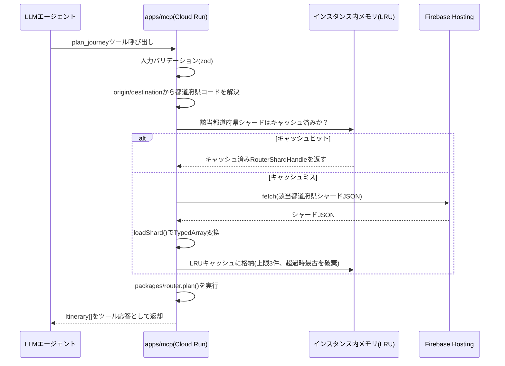
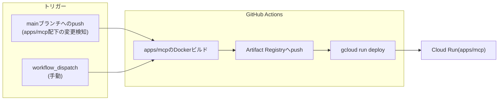

# MCPサーバーAPI仕様書 — ノリシロ

**状態: 完了（設計確定。W6成果物）**
**作成日: 2026-07-02**
**対象読者: `apps/mcp`を実装する開発者（Claude Code）／MCPクライアント（LLMエージェント）を開発・設定する利用者**

本書は`08_作業計画_WBS.md`のW6（`docs/14_MCPサーバーAPI仕様.md`）に対応する成果物であり、ユーザーが確定した設計判断（本書冒頭の「確定済み設計判断」）を正典として体系化・肉付けしたものである。設計判断そのものの変更・追加提案は行わず、別途9章「代替案・未決事項」に分離して記載する。本書はネットワーク調査を伴わず、既存資料との整合を取ることに専念する。

**前提資料との関係**:

- `11_アーキテクチャ設計.md`（特に2章・3章(b)・4章・5章）が定める`apps/mcp`の位置づけ（`packages/router`をNode環境で実行するCloud Runサービス、Firebase Hostingが配信する地域シャードをapps/webと共同参照、認証なし公開、min-instances=0のスケールtoゼロ、簡易レート制限、GCP無料枠試算とmax-instances制限）を実行環境の制約として受け入れ、本書はその上でMCPツール自体の入出力契約・エラー設計・デプロイ設定値を確定する。
- `13_ルーティングエンジン設計.md`（特に8章「APIの型定義」）が定める`packages/router`の公開契約（`PlanRequest`/`Itinerary`/`LocationRef`/`Leg`/`IsochroneResult`等の型、`plan()`/`isochrone()`/`loadShard()`関数）を**そのまま再利用する**。本書が定義するMCPツールは、この`packages/router`の型・関数への薄いラッパーであり、探索アルゴリズムや型定義を独自に再定義しない（確定済み設計判断3）。
- `12_データパイプライン設計.md`（特に4章・6章）が規定するシャード形式（v1圧縮JSON、列指向・配列インデックス参照方式）とクレジット生成（`CreditManifest`/`CreditEntry`型、`credits.json`としてFirebase Hostingに配信）を、`list_data_sources`ツール（3.6節）および4章のシャード管理の入力契約として受け入れる。

---

## 目次

1. [概要と設計原則](#1-概要と設計原則)
2. [トランスポート・エンドポイント・レート制限](#2-トランスポートエンドポイントレート制限)
3. [ツールリファレンス](#3-ツールリファレンス)
   - 3.1 [`plan_journey`](#31-plan_journey)
   - 3.2 [`search_stops`](#32-search_stops)
   - 3.3 [`list_flex_services`](#33-list_flex_services)
   - 3.4 [`get_booking_rules`](#34-get_booking_rules)
   - 3.5 [`get_isochrone`](#35-get_isochrone)
   - 3.6 [`list_data_sources`](#36-list_data_sources)
4. [シャード管理とメモリ設計](#4-シャード管理とメモリ設計)
5. [エラー設計](#5-エラー設計)
6. [セキュリティ](#6-セキュリティ)
7. [デプロイ](#7-デプロイ)
8. [クライアント接続ガイド](#8-クライアント接続ガイド)
9. [代替案・未決事項](#9-代替案未決事項)

---

## 1. 概要と設計原則

### 1.1 apps/mcpの位置づけ（再確認）

`apps/mcp`はMCP（Model Context Protocol）公式TypeScript SDK（`@modelcontextprotocol/sdk`）を用いて実装するMCPサーバーであり、Cloud Run上で稼働する。`11_アーキテクチャ設計.md` 3章(b)が定めるシーケンス（LLMエージェント→MCPツール呼び出し→Cloud Run→Firebase Hostingから地域シャードfetch→`packages/router`でRAPTOR+Flex探索→結果をMCPツール応答として返却）を、本書はツール単位の入出力契約として具体化する。

### 1.2 設計原則

| 原則 | 内容 | 根拠 |
|---|---|---|
| **ステートレス運用** | MCPサーバー自体はセッション間で状態を持たない。Cloud Runのmin-instances=0によるコールドスタートが発生しても、リクエスト単位で完結する処理のみを行う（4章のシャードキャッシュはインスタンス内メモリ上の最適化であり、正しさの前提としない） | `11_アーキテクチャ設計.md` 3章(b)「Cloud Runはmin-instances=0のスケールtoゼロ構成」 |
| **router再利用** | 経路探索・到達圏算出のアルゴリズム実装は`packages/router`の`plan()`/`isochrone()`をそのまま呼び出す。MCPツール層は入力の妥当性検証・シャードのロード・出力の整形のみを担当し、探索ロジックを二重実装しない | `11_アーキテクチャ設計.md` 2章の依存方向ルール、`13_ルーティングエンジン設計.md` 8章 |
| **コスト0円制約** | 開発者側の課金が発生しない構成を維持する。LLM推論コストは接続元の利用者自身のLLM契約側で発生し、MCPサーバー側はアルゴリズム実行のみ（LLM推論を一切行わない）。Cloud Runの無料枠・max-instances制限・GCP予算アラート（月100円）と整合させる | `11_アーキテクチャ設計.md` 3章(b)・4章、`06_合体案`の「頭脳はアルゴリズム、LLMはただの入り口」方針 |
| **データベース不使用** | MCPサーバーは自前のデータストアを持たない。参照するのはFirebase Hostingが配信する静的な地域シャード（apps/webと同一ファイル）のみである | `11_アーキテクチャ設計.md` 1章・3章(b) |
| **v1はtoolsのみ** | MCP仕様が提供するresources/promptsの機能は本書のv1では採用しない。将来拡張として9.2節に扱いのみ記載する（確定済み設計判断2） | 確定済み設計判断2 |

### 1.3 本書のスコープ外

- `packages/router`のアルゴリズム内部（RAPTORラウンド処理、Flex仮想レッグ注入の疑似コード）は`13_ルーティングエンジン設計.md`の管轄であり、本書では再掲しない（型定義の再利用のみ行う）。
- シャードファイル形式そのもの（`Shard`/`CompressedStops`等のJSONスキーマ）は`12_データパイプライン設計.md` 4章の管轄であり、本書はそれを「MCPサーバーがどのタイミングでfetchし、どうキャッシュするか」という観点でのみ扱う（4章）。
- `apps/web`側のUI・音声入力等は本書のスコープ外（`11_アーキテクチャ設計.md` 2章のapps/web責務）。

---

## 2. トランスポート・エンドポイント・レート制限

### 2.1 トランスポート

確定済み設計判断1に従い、MCP公式TypeScript SDK（`@modelcontextprotocol/sdk`）の**Streamable HTTPトランスポート**を採用する。stdioトランスポート（ローカルプロセス起動を前提とする方式）は、Cloud Run上でHTTPエンドポイントとして公開する本構成とは前提が合わないため採用しない（9.1節で不採用理由を整理）。

| 項目 | 値 |
|---|---|
| トランスポート | Streamable HTTP（`@modelcontextprotocol/sdk`の`StreamableHTTPServerTransport`） |
| MCPエンドポイント | `POST /mcp`（Streamable HTTPの単一エンドポイント。SDKの既定パスに従う） |
| Content-Type | `application/json`（JSON-RPC 2.0メッセージ） |
| セッション管理 | ステートレス運用（1.2節）のため、SDKが提供するセッションID機能は使用せず、リクエストごとに独立したハンドラ呼び出しとして扱う |
| 稼働先 | Cloud Run、`min-instances=0`（コールドスタートを許容し、リクエストが無い間は課金対象インスタンスを維持しない） |

### 2.2 認証

**認証なしで公開する**（確定済み設計判断1、`11_アーキテクチャ設計.md` 5章が定める「世界中のLLMエージェントが接続できる」というエコシステム貢献方針の継承）。APIキー・OAuthトークン等のクライアント認証は要求しない。認証なし＝無防備ではなく、2.3節のレート制限と6章の入力ガードによって悪用への防御を行う。

### 2.3 レート制限

| 項目 | 値 | 補足 |
|---|---|---|
| 制限単位 | IPベース（送信元IPアドレスごと） | Cloud Runが受け取るリクエストの送信元IP（プロキシ経由の場合は`X-Forwarded-For`等の信頼できるヘッダから解決）を鍵とする |
| 制限値 | **60リクエスト/分/IP** | 確定済み設計判断1のとおり |
| 超過時の応答 | **HTTP 429 Too Many Requests** | JSON-RPCレベルのエラーではなく、HTTPステータスコードでの応答とする（MCPツール呼び出しの応答（`isError`）に至る前段でブロックするため。5章のエラー分類「レート超過」と対応） |
| アルゴリズム | 固定windowまたはトークンバケット（実装詳細は9.2節の未決事項。60req/分/IPという値自体は確定済み設計判断） | `11_アーキテクチャ設計.md` 8章未決事項3「Cloud Runのレート制限の具体的な実装方式」を本書で確定する範囲は「60req/分/IP・429応答」という契約であり、アルゴリズム選定は実装時の詳細に委ねる |
| 実装位置 | Cloud Runコンテナ内のアプリケーション層（ミドルウェア） | Cloud Run自体の同時実行数制限（7章）とは別の防御層。同時実行数制限は「同時に処理できるリクエスト数」、レート制限は「単位時間あたりのリクエスト数」を制御し、目的が異なる |
| レスポンスヘッダ | `Retry-After`（推奨、秒数） | クライアント（LLMエージェント）が再試行タイミングを判断できるようにする |

### 2.4 v1のtools-onlyポリシー

確定済み設計判断2に従い、v1では以下の方針とする。

- **提供するのはtoolsのみ**（3章の6ツール）。
- **resources**（MCPのURI経由での読み取り専用データ公開機能）・**prompts**（プロンプトテンプレート提供機能）は、v1では実装しない。将来拡張の可能性のみ9.2節に記載し、本書のツールリファレンス（3章）とは独立して扱う。
- 理由: `plan_journey`等のツールはいずれも動的な入力（出発地・目的地・日時）に依存する処理であり、静的なresourceとして事前公開する性質のデータではない。`list_data_sources`（3.6節）のような「引数なしで固定的な情報を返す」ツールはresource化の余地があるが、v1では実装の単純性（tools一種類に統一し、クライアント側のツール呼び出しフローのみで完結させる）を優先し、tool形式に統一する。

---

## 3. ツールリファレンス

本章の各ツールは、`13_ルーティングエンジン設計.md` 8章が定める`packages/router`の型（`PlanRequest`, `Itinerary`, `LocationRef`, `Leg`, `IsochroneResult`等）および`packages/types`が提供する共有型を再利用する。ツールの入出力zodスキーマは、これらの型と1対1に対応するように定義し、独自の型を新設しない（1.2節「router再利用」原則）。

各ツールの`description`はLLMエージェントがツールを選択・呼び出す際に参照する文字列であり、**誤用を防ぐための制約・前提を明示する**ことを設計方針とする（確定済み設計判断3・6）。

### 3.1 `plan_journey`

#### 目的

出発地から目的地までの経路を、指定した出発日時を起点に検索する。固定路線（鉄道・バス）とGTFS-Flex（デマンド交通）を統合したPareto最適経路（到着時刻×乗換回数）を返す。Flexレッグを含む経路には、予約に必要な電話番号・予約締切時刻・案内メッセージを必ず含める（確定済み設計判断3）。

#### description（LLM向け）

```
出発地から目的地までの経路を検索する。日本の鉄道・バスに加え、デマンド交通（GTFS-Flex、
事前予約制の乗合バス等）を統合して検索する。

【重要な制約】
- 出発時刻の指定のみに対応する。到着時刻を指定した逆算検索は非対応（未来のバージョンで対応予定）。
- 単一のサービス日内の検索のみ対応する。深夜0時をまたぐ移動で日付が変わる場合、翌日分は別の
  検索として扱われることがある。
- 経路にデマンド交通（Flexレッグ）が含まれる場合、summary.requiresBooking が true になる。
  この場合、該当レッグの booking フィールド（電話番号・予約締切・案内文）を利用者にそのまま
  伝えること。予約締切を過ぎている経路は結果に含まれない（実行不可能な経路は返さない）。
- データが整備されていない地域（GTFSフィードが未取得の市町村等）を指定した場合、
  isError: true の応答が返る。全国のすべての地域を保証するものではない。
- 座標は日本国内を想定する。国外の座標を指定した場合の動作は保証されない。
```

#### 入力zodスキーマ

```typescript
import { z } from "zod";

const LocationRefSchema = z.union([
  z.object({
    kind: z.literal("coord"),
    lat: z.number().min(-90).max(90),
    lon: z.number().min(-180).max(180),
  }),
  z.object({
    kind: z.literal("stopId"),
    stopId: z.string().min(1),
  }),
  z.object({
    kind: z.literal("stopName"),
    // stopId解決前の名称指定。サーバー側でsearch_stopsと同じ名寄せロジックを介して
    // 最も一致度の高い1件に解決する（複数該当時の挙動は3.1節「入力の解決順序」参照）
    stopName: z.string().min(1),
  }),
]);

const PlanJourneyInputSchema = z.object({
  origin: LocationRefSchema.describe(
    "出発地。座標(kind:coord)、停留所ID(kind:stopId)、停留所名の部分一致(kind:stopName)のいずれかで指定する。",
  ),
  destination: LocationRefSchema.describe("目的地。originと同じ形式で指定する。"),
  departureTime: z
    .string()
    .datetime({ offset: true })
    .describe(
      "出発日時。ISO 8601形式（例: 2026-07-07T09:00:00+09:00）。タイムゾーンオフセットを含めること。" +
        "省略不可（到着時刻指定はv1未対応）。",
    ),
  options: z
    .object({
      maxTransfers: z
        .number()
        .int()
        .min(0)
        .max(6)
        .optional()
        .describe("最大乗換回数。省略時はサーバー既定値（6）。"),
      walkLimitMeters: z
        .number()
        .int()
        .min(50)
        .max(2000)
        .optional()
        .describe("徒歩移動の距離上限（メートル）。省略時はサーバー既定値（800m）。上限2000mを超える指定は拒否する。"),
    })
    .optional()
    .describe("検索オプション。省略時は全て既定値を使う。"),
});
```

#### 出力構造

`packages/router`の`Itinerary[]`（`13_ルーティングエンジン設計.md` 8章）をそのまま配列で返す。MCPツール応答としてはJSON-RPCの`content`（`type: "text"`、JSON文字列としてシリアライズ）に格納する。

```typescript
interface PlanJourneyOutput {
  itineraries: Itinerary[];   // 13_ルーティングエンジン設計.md 8章のItinerary型そのもの
  // itineraries.length === 0 の場合は「探索は成功したが実行可能な経路が0件」を意味する
  // （エラーではない。例: 予約締切を全て過ぎている、対象日に運行がない等）
}

// Itinerary = { legs: Leg[]; summary: ItinerarySummary }
// Leg = WalkLeg | TransitLeg | FlexLeg
// FlexLeg.booking: { phoneNumber?, message?, deadline?, infoUrl?, bookingUrl? }
```

**Flexレッグのbooking情報について**: `FlexLeg`が経路中に1つでも含まれる場合、`summary.requiresBooking = true`となる。各`FlexLeg.booking`には`13_ルーティングエンジン設計.md` 6.4節の`toPublicLeg`が解決した予約情報（電話番号・案内文・締切時刻・情報URL・予約URL）が付与される。これらは`undefined`になりうる（寛容パーサのフォールバック、`booking_rules.txt`が存在しない・締切不明等）が、値が存在する場合は必ず利用者に伝えるべき情報として扱う。

#### エラー

| ケース | エラー分類（5章） |
|---|---|
| `departureTime`が不正な形式・過去日時等 | 入力不正 |
| origin/destinationの`stopId`/`stopName`が解決できない | 入力不正 |
| origin/destinationが属する地域のシャードが未整備 | データ未整備地域 |
| Firebase Hostingからのシャードfetchに失敗 | シャード取得失敗 |
| レート制限超過 | レート超過（2.3節、HTTP 429で処理されるため通常はこのツール応答には到達しない） |

#### 呼び出し例JSON

```json
{
  "jsonrpc": "2.0",
  "id": 1,
  "method": "tools/call",
  "params": {
    "name": "plan_journey",
    "arguments": {
      "origin": { "kind": "stopName", "stopName": "殿ケ谷会館" },
      "destination": { "kind": "stopName", "stopName": "みずほ病院" },
      "departureTime": "2026-07-07T09:00:00+09:00",
      "options": { "maxTransfers": 4, "walkLimitMeters": 800 }
    }
  }
}
```

（2026-07-07は火曜日。瑞穂町Flexデータの`east_service`運行日に対応する検証用シナリオ。8.2節の対話例1と対応する。）

#### 応答例JSON

```json
{
  "jsonrpc": "2.0",
  "id": 1,
  "result": {
    "content": [
      {
        "type": "text",
        "text": "{\"itineraries\":[{\"legs\":[{\"kind\":\"flex\",\"locationGroupId\":\"mizuhomachi_group\",\"tripId\":\"east_trip\",\"fromStopId\":\"1\",\"toStopId\":\"37\",\"departureTime\":32400,\"arrivalTime\":33159,\"booking\":{\"phoneNumber\":\"050-2030-2630\",\"message\":\"ご利用の30分前までに予約が必要で、電話予約は8:30から16:30まで、オンライン予約は24時間受付\",\"deadline\":30600,\"infoUrl\":null,\"bookingUrl\":null}}],\"summary\":{\"departureTime\":32400,\"arrivalTime\":33159,\"durationSec\":759,\"transferCount\":0,\"requiresBooking\":true}}]}"
      }
    ],
    "isError": false
  }
}
```

（`text`フィールド内のJSON文字列を整形すると以下の通り。乗車09:00・降車推定09:12:39、予約締切08:30。`13_ルーティングエンジン設計.md` 10.1節T-R-DUR-02の検証値と一致する。）

```json
{
  "itineraries": [
    {
      "legs": [
        {
          "kind": "flex",
          "locationGroupId": "mizuhomachi_group",
          "tripId": "east_trip",
          "fromStopId": "1",
          "toStopId": "37",
          "departureTime": 32400,
          "arrivalTime": 33159,
          "booking": {
            "phoneNumber": "050-2030-2630",
            "message": "ご利用の30分前までに予約が必要で、電話予約は8:30から16:30まで、オンライン予約は24時間受付",
            "deadline": 30600,
            "infoUrl": null,
            "bookingUrl": null
          }
        }
      ],
      "summary": {
        "departureTime": 32400,
        "arrivalTime": 33159,
        "durationSec": 759,
        "transferCount": 0,
        "requiresBooking": true
      }
    }
  ]
}
```

#### 入力の解決順序（`kind: "stopName"`使用時の補足）

`stopName`指定は、サーバー内部で`search_stops`（3.2節）と同じ名称部分一致ロジックを使い最も一致度の高い1件に解決する。複数の停留所が同程度の一致度を持つ場合（曖昧性がある場合）は、解決に失敗したものとして「入力不正」エラー（5章）を返し、候補一覧を`search_stops`で確認するよう促すメッセージを付与する。この曖昧性解消の詳細な閾値・スコアリング方式は実装詳細として9.2節の未決事項に委ねる。

---

### 3.2 `search_stops`

#### 目的

停留所・location_group（Flexサービスのグループ）を、名称の部分一致、または座標＋半径で検索する。`plan_journey`の`origin`/`destination`を`stopId`で正確に指定する前段として、あるいは単独での地名探索として使う。

#### description（LLM向け）

```
停留所（駅・バス停等）またはデマンド交通のサービスエリア（location_group）を検索する。
名称の部分一致検索、または座標＋半径検索のいずれかを指定する（両方同時の指定は不可）。

【重要な制約】
- 半径検索の半径は上限5000m（5km）。これを超える半径を指定した場合はサーバー側で
  5000mに切り詰められる（拒否ではなく上限適用、6章参照）。
- 名称検索は前方一致・部分一致を行うが、読み仮名・旧称・通称には対応しない場合がある。
- 該当0件は正常な結果（isError: falseで空配列を返す）であり、エラーではない。
- 大量の結果が見込まれる緩い検索条件（例: 1文字だけの名称検索）は結果件数を100件に
  制限する場合がある。
```

#### 入力zodスキーマ

```typescript
const SearchStopsInputSchema = z
  .object({
    query: z
      .object({
        mode: z.literal("name"),
        text: z.string().min(1).max(100).describe("停留所名・location_group名の検索文字列（部分一致）。"),
      })
      .or(
        z.object({
          mode: z.literal("radius"),
          lat: z.number().min(-90).max(90),
          lon: z.number().min(-180).max(180),
          radiusMeters: z
            .number()
            .positive()
            .max(5000)
            .describe("検索半径（メートル）。上限5000m。"),
        }),
      )
      .describe("検索条件。名称検索(mode:name)または座標+半径検索(mode:radius)のいずれか一方。"),
    limit: z
      .number()
      .int()
      .min(1)
      .max(100)
      .optional()
      .describe("最大返却件数。省略時は50。上限100。"),
  })
  .describe("停留所・location_group検索の入力。");
```

#### 出力構造

```typescript
interface SearchStopsOutput {
  stops: StopSearchResult[];
}

interface StopSearchResult {
  stopId: string;
  stopName: string;
  lat: number;
  lon: number;
  /** 通常の固定路線停留所か、Flexサービスのlocation_groupに属するかの種別 */
  kind: "fixed" | "flex_member";
  /** kind === "flex_member" の場合、所属するlocation_groupId（複数所属可） */
  flexGroupIds?: string[];
  /** mode: "radius" 検索時のみ、検索中心からの距離（メートル） */
  distanceMeters?: number;
}
```

#### エラー

| ケース | エラー分類 |
|---|---|
| `query`が`name`/`radius`どちらの形式にも一致しない、両方混在指定 | 入力不正 |
| `radiusMeters`が5000超（切り詰め処理のため通常エラーにはならない、6章） | （ガード適用、エラーにしない） |
| 検索対象地域のシャードが未取得 | データ未整備地域 |

#### 呼び出し例JSON

```json
{
  "jsonrpc": "2.0",
  "id": 2,
  "method": "tools/call",
  "params": {
    "name": "search_stops",
    "arguments": {
      "query": { "mode": "name", "text": "みずほ病院" },
      "limit": 10
    }
  }
}
```

#### 応答例JSON

```json
{
  "jsonrpc": "2.0",
  "id": 2,
  "result": {
    "content": [
      {
        "type": "text",
        "text": "{\"stops\":[{\"stopId\":\"37\",\"stopName\":\"みずほ病院\",\"lat\":35.77551,\"lon\":139.34549,\"kind\":\"flex_member\",\"flexGroupIds\":[\"mizuhomachi_group\"]}]}"
      }
    ],
    "isError": false
  }
}
```

---

### 3.3 `list_flex_services`

#### 目的

指定エリア（都道府県・自治体名）で利用可能なデマンド交通（GTFS-Flex）サービスの一覧を返す。運行曜日・時間窓・予約ルールの概要を含み、「このエリアにデマンド交通はあるか」という探索的な問いに応える。

#### description（LLM向け）

```
指定した都道府県・市区町村でデマンド交通（事前予約制の乗合バス、GTFS-Flex）が
利用可能かどうか、利用可能な場合はサービス概要（運行曜日・時間窓・予約方法の概要）を
一覧で返す。

【重要な制約】
- エリア名は都道府県名または市区町村名の文字列一致で解釈する。表記揺れ（「瑞穂町」
  「瑞穂」等）への耐性は限定的であり、該当なしの場合は0件の配列を返す（エラーにしない）。
- このツールは概要一覧のみを返す。予約方法の詳細（そのまま利用者に案内できる文面）が
  必要な場合は get_booking_rules をサービスID指定で呼び出すこと。
- 全国のすべての市区町村を保証するものではない。データパイプラインが取り込んでいない
  自治体は0件になる（データ未整備であり、サービスが存在しないことの証明ではない）。
```

#### 入力zodスキーマ

```typescript
const ListFlexServicesInputSchema = z.object({
  area: z
    .object({
      prefecture: z.string().min(1).describe("都道府県名（例: 東京都）。"),
      municipality: z.string().optional().describe("市区町村名（例: 瑞穂町）。省略時は都道府県全域が対象。"),
    })
    .describe("検索対象エリア。"),
});
```

#### 出力構造

```typescript
interface ListFlexServicesOutput {
  services: FlexServiceSummary[];
}

interface FlexServiceSummary {
  /** get_booking_rules呼び出し時に指定するサービス識別子。flexGroupId + flexTripIdの組で一意 */
  serviceId: string;
  locationGroupId: string;
  serviceName: string | null;
  providerName: string;
  /** 運行曜日の概要（例: "火・金・土"）。calendar.txtの展開結果を人間可読な形に要約 */
  operatingDaysSummary: string;
  /** 時間窓の概要（例: "09:00-17:00"） */
  timeWindowSummary: string;
  /** 予約要否の概要（詳細はget_booking_rulesで取得） */
  bookingSummary: string;
  memberStopCount: number;
}
```

#### エラー

| ケース | エラー分類 |
|---|---|
| `prefecture`が空文字等の不正値 | 入力不正 |
| 該当エリアのシャードが未整備 | データ未整備地域（0件配列を返すのではなく明示的にエラーにするか否かは9.2節の未決事項。v1は「シャード自体が存在しない」場合のみエラーとし、「シャードは存在するがFlexデータが0件」は正常応答として空配列を返す） |

#### 呼び出し例JSON

```json
{
  "jsonrpc": "2.0",
  "id": 3,
  "method": "tools/call",
  "params": {
    "name": "list_flex_services",
    "arguments": {
      "area": { "prefecture": "東京都", "municipality": "瑞穂町" }
    }
  }
}
```

#### 応答例JSON

```json
{
  "jsonrpc": "2.0",
  "id": 3,
  "result": {
    "content": [
      {
        "type": "text",
        "text": "{\"services\":[{\"serviceId\":\"mizuhomachi_group:east_trip\",\"locationGroupId\":\"mizuhomachi_group\",\"serviceName\":\"チョイソコみずほまち（東ルート）\",\"providerName\":\"瑞穂町\",\"operatingDaysSummary\":\"火・金・土\",\"timeWindowSummary\":\"09:00-17:00\",\"bookingSummary\":\"乗車30分前までに電話予約が必要\",\"memberStopCount\":120},{\"serviceId\":\"mizuhomachi_group:west_trip\",\"locationGroupId\":\"mizuhomachi_group\",\"serviceName\":\"チョイソコみずほまち（西ルート）\",\"providerName\":\"瑞穂町\",\"operatingDaysSummary\":\"月・水・木\",\"timeWindowSummary\":\"09:00-17:00\",\"bookingSummary\":\"乗車30分前までに電話予約が必要\",\"memberStopCount\":120}]}"
      }
    ],
    "isError": false
  }
}
```

---

### 3.4 `get_booking_rules`

#### 目的

指定したサービスID（`list_flex_services`が返す`serviceId`）について、予約方法の詳細を返す。**そのまま利用者に読み上げられる形式**（確定済み設計判断3）であることを重視し、電話番号・受付時間・締切ルール・案内文をそのまま提示できる自然文を含む。

#### description（LLM向け）

```
デマンド交通サービスの予約方法の詳細を取得する。list_flex_services で得た serviceId を
指定する。応答に含まれる spokenGuidance フィールドは、利用者にそのまま読み上げる・
表示することを想定した完成済みの案内文である。要約・言い換えを加えず、そのまま伝えること
を推奨する。

【重要な制約】
- serviceId が不明な場合、まず list_flex_services でサービス一覧を取得すること。
- 締切時刻は「何時何分までに予約すればよいか」という一般的なルールの説明であり、
  特定の乗車時刻に対する具体的な締切計算（例: 本日9時発なら8時30分までに予約）が
  必要な場合は plan_journey の結果に含まれる booking.deadline を使うこと。
  get_booking_rules 単体では「今日の何便に対する締切か」という文脈は解決できない。
```

#### 入力zodスキーマ

```typescript
const GetBookingRulesInputSchema = z.object({
  serviceId: z
    .string()
    .min(1)
    .describe("list_flex_servicesが返すサービス識別子（例: mizuhomachi_group:east_trip）。"),
});
```

#### 出力構造

```typescript
interface GetBookingRulesOutput {
  serviceId: string;
  bookingType: 0 | 1 | 2;   // 10_GTFS-Flex実装仕様.md 2.4.1節のEnum
  phoneNumber: string | null;
  /** 受付可能な曜日・時間帯（構造化データ側の情報から判定できる範囲。message文中にのみ
   *  記載され構造化列が無い情報（例:「電話予約は8:30から16:30まで」）は含まれない場合がある */
  priorNoticeRule: {
    kind: "same_day_minutes_before" | "prior_days" | "real_time" | "unknown";
    minutesBefore?: number;         // bookingType=1
    lastDayOffset?: number;         // bookingType=2
    lastTime?: string;               // bookingType=2, "HH:MM:SS"
  };
  infoUrl: string | null;
  bookingUrl: string | null;
  /** そのまま利用者に提示する完成済みの案内文。booking_rules.txtのmessage列を正本とする */
  spokenGuidance: string;
}
```

#### エラー

| ケース | エラー分類 |
|---|---|
| `serviceId`が存在しない（形式不正、または該当サービスなし） | 入力不正 |
| serviceIdが属する地域のシャードが未整備 | データ未整備地域 |

#### 呼び出し例JSON

```json
{
  "jsonrpc": "2.0",
  "id": 4,
  "method": "tools/call",
  "params": {
    "name": "get_booking_rules",
    "arguments": { "serviceId": "mizuhomachi_group:east_trip" }
  }
}
```

#### 応答例JSON

```json
{
  "jsonrpc": "2.0",
  "id": 4,
  "result": {
    "content": [
      {
        "type": "text",
        "text": "{\"serviceId\":\"mizuhomachi_group:east_trip\",\"bookingType\":1,\"phoneNumber\":\"050-2030-2630\",\"priorNoticeRule\":{\"kind\":\"same_day_minutes_before\",\"minutesBefore\":30},\"infoUrl\":null,\"bookingUrl\":null,\"spokenGuidance\":\"ご利用の30分前までに予約が必要で、電話予約は8:30から16:30まで、オンライン予約は24時間受付\"}"
      }
    ],
    "isError": false
  }
}
```

---

### 3.5 `get_isochrone`

#### 目的

出発地・出発日時・複数のカットオフ分数（例: `[15, 30, 60]`）から、それぞれの時間内に到達可能な範囲をGeoJSONの到達圏ポリゴンとして返す。`13_ルーティングエンジン設計.md` 7章の`isochrone()`をそのまま呼び出す。自治体向け副産物・審査デモ用の位置づけ（`06_合体案`）を継承する。

#### description（LLM向け）

```
指定した出発地・出発時刻から、複数の時間（分）以内に到達可能な範囲をGeoJSONの
ポリゴンとして返す。「30分以内に行ける場所はどこか」という問いに答える。

【重要な制約】
- cutoffs（カットオフ分数の配列）は最大5要素まで、各値は最大180分までに制限される。
  これを超える指定は入力不正エラーになる（6章の悪用防止ガード）。
- 応答サイズには上限がある。到達範囲が広域になる場合（都道府県境を越える等）、
  サーバー側でポリゴンを簡略化した上で返す（見た目の詳細さより応答成立を優先する）。
  簡略化が行われた場合、応答に simplified: true が付与される。
- ポリゴンは凸包（ConvexHull）による近似であり、実際の到達圏より広めに出ることがある
  （道路がない領域も到達圏に含まれる場合がある、13_ルーティングエンジン設計.md 7.3節）。
  正確な道路網ベースの到達圏ではなく、概観把握用の近似図として扱うこと。
```

#### 入力zodスキーマ

```typescript
const GetIsochroneInputSchema = z.object({
  origin: LocationRefSchema.describe("出発地。座標(kind:coord)、停留所ID(kind:stopId)のいずれか。"),
  departureTime: z
    .string()
    .datetime({ offset: true })
    .describe("出発日時。ISO 8601形式、タイムゾーンオフセット必須。"),
  cutoffsMinutes: z
    .array(z.number().positive().max(180))
    .min(1)
    .max(5)
    .describe("到達圏を計算するカットオフ分数の配列。最大5要素、各値は最大180分。例: [15, 30, 60]。"),
});
```

#### 出力構造

```typescript
interface GetIsochroneOutput {
  // 13_ルーティングエンジン設計.md 8章のIsochroneResult（GeoJSON FeatureCollection）
  geojson: IsochroneResult;
  /** 応答サイズ上限超過により簡略化ポリゴンへ切り替えた場合true */
  simplified: boolean;
}
```

#### 応答サイズ上限とフォールバック（確定済み設計判断3）

- 通常のポリゴン生成（`13_ルーティングエンジン設計.md` 7.3節の凸包計算）による座標点数の合計が、実装定数の上限（例: 全feature合計で2000座標点）を超えた場合、以下の簡略化を段階的に適用する。
  1. 各cutoffのポリゴンの頂点数を削減する（Douglas-Peucker等の簡略化アルゴリズム、または凸包頂点の間引き）。
  2. なお上限を超える場合、cutoffsのうち最大値のみを残し、他は`properties`に「簡略化のため省略」を示すメタ情報のみ返す。
- いずれの簡略化を適用した場合も`simplified: true`を応答に含め、LLMエージェントが「この結果は近似の簡略版である」と利用者に伝えられるようにする。

#### エラー

| ケース | エラー分類 |
|---|---|
| `cutoffsMinutes`が空配列、6要素以上、180超の値を含む | 入力不正 |
| originが未整備地域 | データ未整備地域 |

#### 呼び出し例JSON

```json
{
  "jsonrpc": "2.0",
  "id": 5,
  "method": "tools/call",
  "params": {
    "name": "get_isochrone",
    "arguments": {
      "origin": { "kind": "stopName", "stopName": "殿ケ谷会館" },
      "departureTime": "2026-07-07T09:00:00+09:00",
      "cutoffsMinutes": [15, 30]
    }
  }
}
```

#### 応答例JSON

```json
{
  "jsonrpc": "2.0",
  "id": 5,
  "result": {
    "content": [
      {
        "type": "text",
        "text": "{\"geojson\":{\"type\":\"FeatureCollection\",\"features\":[{\"type\":\"Feature\",\"properties\":{\"cutoffSec\":900},\"geometry\":{\"type\":\"Polygon\",\"coordinates\":[[[139.360,35.762],[139.368,35.762],[139.368,35.769],[139.360,35.769],[139.360,35.762]]]}},{\"type\":\"Feature\",\"properties\":{\"cutoffSec\":1800},\"geometry\":{\"type\":\"Polygon\",\"coordinates\":[[[139.352,35.758],[139.376,35.758],[139.376,35.775],[139.352,35.775],[139.352,35.758]]]}}]},\"simplified\":false}"
      }
    ],
    "isError": false
  }
}
```

（座標値は簡略化した例示であり実測値ではない。）

---

### 3.6 `list_data_sources`

#### 目的

引数なしで、パイプラインが取り込んでいる全データの出典・ライセンス・クレジット一覧を返す。透明性と応募規約・ライセンス遵守（`12_データパイプライン設計.md` 6章のクレジット生成、`09_固定路線データ調査.md` 6.3節のライセンス遵守要件）をMCP経由でも果たすための窓口である。

#### description（LLM向け）

```
このサービスが使用しているデータの出典・ライセンス・クレジット表記の一覧を取得する。
引数は不要。データの二次利用条件を利用者に説明する必要がある場合や、「このデータは
どこから来ているのか」という質問に答える場合に使うこと。
```

#### 入力zodスキーマ

```typescript
const ListDataSourcesInputSchema = z.object({}).describe("引数なし。");
```

#### 出力構造

`12_データパイプライン設計.md` 6.2節の`CreditManifest`をそのまま返す。

```typescript
interface ListDataSourcesOutput {
  generatedAt: string;   // ISO 8601。CreditManifest.generatedAt
  entries: CreditEntry[];
  // CreditEntry = { feedId, providerName, creditText, licenseId, licenseUrl, sourceUrl,
  //                 challengeLimited, prefecture }
}
```

#### エラー

このツールは引数を取らないため入力不正は原則発生しない。`credits.json`（Firebase Hosting配信の静的ファイル）自体のfetch失敗のみがエラー要因となる。

| ケース | エラー分類 |
|---|---|
| `credits.json`のfetchに失敗 | シャード取得失敗（クレジットJSONもシャードと同様Firebase Hostingから配信される静的ファイルであるため、同じエラー分類を用いる） |

#### 呼び出し例JSON

```json
{
  "jsonrpc": "2.0",
  "id": 6,
  "method": "tools/call",
  "params": { "name": "list_data_sources", "arguments": {} }
}
```

#### 応答例JSON

```json
{
  "jsonrpc": "2.0",
  "id": 6,
  "result": {
    "content": [
      {
        "type": "text",
        "text": "{\"generatedAt\":\"2026-07-02T03:00:00+09:00\",\"entries\":[{\"feedId\":\"mizuho-flex-demand\",\"providerName\":\"瑞穂町\",\"creditText\":\"瑞穂町「チョイソコみずほまち」GTFS-Flexデータ（CC BY 4.0）を加工して作成\",\"licenseId\":\"CC BY 4.0\",\"licenseUrl\":\"https://creativecommons.org/licenses/by/4.0/deed.ja\",\"sourceUrl\":\"https://gtfs-data.jp/search?target_feed=mizuhotown*DemandResponsiveTransport\",\"challengeLimited\":false,\"prefecture\":\"13\"}]}"
      }
    ],
    "isError": false
  }
}
```

---

## 4. シャード管理とメモリ設計

### 4.1 起動時ロード

Cloud Runインスタンスの起動時（コールドスタート発生時）に、**鉄道バックボーンシャード**（`12_データパイプライン設計.md` 4.1節、全国鉄道の広域移動用軽量グラフ、gzip後2MB以下）をFirebase Hostingからfetchし、`packages/router`の`loadShard()`でメモリ上にロードする。バックボーンは広域移動の接続点として全ツール（特に`plan_journey`・`get_isochrone`）から共通参照されるため、リクエストを待たずに事前ロードする（確定済み設計判断4）。

### 4.2 都道府県シャードの遅延ロード＋LRUキャッシュ

都道府県シャード（`12_データパイプライン設計.md` 4.1節、gzip後3MB以下）は、リクエストが実際にその都道府県を参照する時点で初めてfetch・ロードする（確定済み設計判断4「要求時に遅延ロード」）。

| 項目 | 値 | 根拠 |
|---|---|---|
| キャッシュ方式 | LRU（Least Recently Used） | 確定済み設計判断4 |
| 最大キャッシュシャード数 | **3シャード** | 確定済み設計判断4「メモリ上限512MBインスタンス前提で最大3シャード」 |
| キャッシュ対象 | 都道府県シャードのみ（バックボーンは常駐、4.1節） | バックボーンはLRUの対象から除外し、常にメモリに保持する |
| 破棄タイミング | 4件目の異なる都道府県シャードがリクエストされた時点で、最も参照が古いシャードをアンロードする | LRU方式の標準的な振る舞い |
| インスタンスメモリ上限 | 512MB（Cloud Runインスタンス設定、7章） | 確定済み設計判断4の前提。都道府県シャード1件あたりの実行時メモリ使用量は`13_ルーティングエンジン設計.md` 9.2節の見積り（TypedArray変換後、シャードあたり概算100MB以内目標）を踏まえ、3シャード×100MB＋バックボーン＋Node.jsランタイム自体のオーバーヘッドが512MB以内に収まることを前提とする |

**キャッシュサイズ根拠の注記**: 「最大3シャード」という値は確定済み設計判断としてそのまま採用するが、この値の妥当性（512MBに対して3シャードが安全マージンを持つか）は`13_ルーティングエンジン設計.md` 9.2節の見積り（都道府県シャード規模でstop数1万・trip数5万想定時に概算4MB程度のTypedArray、100MB以内目標）を根拠とする推定であり、実測による検証はW6段階では行っていない。実装時にメモリ使用量の実測が確定済み値と大きく異なる場合の対応は9.2節の未決事項とする。

### 4.3 複数シャード結合（マージ）

`plan_journey`・`get_isochrone`が指定する出発地・目的地（または起点）が異なる都道府県シャードに属する場合、両方のシャード＋バックボーンをロードした上で、`13_ルーティングエンジン設計.md` 9.4節が言及する`mergeShards`相当の結合処理を経て単一の探索空間として扱う。この結合ロジックの具体的な実装（重複stopの名寄せキー設計）は`packages/router`側の内部実装詳細であり、本書はMCPサーバー層が「必要なシャードを揃えてから`plan()`を呼ぶ」責務を持つことのみを規定する（同書1.3節「実行前に必要なシャードを揃えてから`plan()`を呼ぶ」の呼び出し元としての責務）。

### 4.4 シャード取得元

シャード取得元は**Firebase Hostingの公開URL**である（確定済み設計判断4）。MCPサーバー専用の別データストア・別配信経路は持たない。`apps/web`が参照するのと同一の静的ファイルを、MCPサーバーも`fetch()`で取得する（`11_アーキテクチャ設計.md` 3章(b)の継承）。

| 対象 | URL構造の想定 |
|---|---|
| 鉄道バックボーン | `https://<firebase-hosting-domain>/shards/backbone.json`（gzip/brotli圧縮、Cache-Control設定済み） |
| 都道府県シャード | `https://<firebase-hosting-domain>/shards/{prefectureCode}.json`（例: `13.json`＝東京都） |
| クレジットJSON | `https://<firebase-hosting-domain>/credits.json`（3.6節） |

具体的なドメイン・パス構造の最終確定は`apps/pipeline`のdeployステージ（`12_データパイプライン設計.md` 3.6節）の出力パス規約と一致させる必要があり、実装時に確定する（9.2節）。

### 4.5 リクエストごとのシャード解決フロー



---

## 5. エラー設計

### 5.1 統一方針

確定済み設計判断5に従い、全てのツールエラーは**MCPの`isError`応答**（`CallToolResult.isError = true`）に統一する。JSON-RPCレベルのプロトコルエラー（メソッド不明等、MCP SDKが処理する範囲）とは区別し、ツールのビジネスロジック上のエラーは常に`isError: true`かつHTTP 200で返す（MCP仕様の標準的な扱いに合わせる。2.3節のレート制限のみHTTP 429という別経路を取る点に注意）。

### 5.2 エラー分類

| 分類コード | 分類名 | 発生条件の例 | 利用者向け日本語メッセージの方針 |
|---|---|---|---|
| `INVALID_INPUT` | 入力不正 | zodスキーマ検証失敗、日時形式不正、`stopId`/`serviceId`の形式不正、曖昧な名称解決失敗 | 「〜の形式が正しくありません」「〜が複数該当し一意に決まりません」等、**何を直せば再試行できるか**を具体的に示す |
| `DATA_NOT_AVAILABLE` | データ未整備地域 | 指定地域の都道府県シャードが存在しない、シャードは存在するが対象データ種別（Flex等）が0件 | 「この地域のデータは現在整備されていません」等、利用者の入力ミスではないことを明示する |
| `SHARD_FETCH_FAILED` | シャード取得失敗 | Firebase Hostingへの`fetch()`がタイムアウト・5xx等で失敗 | 「一時的にデータを取得できませんでした。しばらく待って再試行してください」等、再試行を促す |
| `RATE_LIMITED` | レート超過 | 2.3節の60req/分/IPを超過（通常はHTTP 429で先に処理されるが、ツール応答経路で検出した場合の予備分類） | 「リクエストが多すぎます。1分ほど待って再試行してください」 |

### 5.3 エラー応答の構造

```typescript
interface ToolErrorContent {
  type: "text";
  text: string;   // 5.4節のJSON構造をシリアライズした文字列
}

interface ToolErrorBody {
  errorCode: "INVALID_INPUT" | "DATA_NOT_AVAILABLE" | "SHARD_FETCH_FAILED" | "RATE_LIMITED";
  message: string;           // 利用者向け日本語メッセージ（5.2節の方針に従う）
  detail?: string;            // 開発者向けの詳細（スタックトレースは含めない。5.5節参照）
  retryable: boolean;         // 再試行で解決する可能性があるか（SHARD_FETCH_FAILED/RATE_LIMITEDはtrue、INVALID_INPUT/DATA_NOT_AVAILABLEはfalse）
}
```

MCPツール応答としては以下の形になる。

```json
{
  "content": [
    {
      "type": "text",
      "text": "{\"errorCode\":\"DATA_NOT_AVAILABLE\",\"message\":\"指定された地域（長野県白馬村）のデータは現在整備されていません。対応地域は現時点で東京都瑞穂町周辺に限定されています。\",\"retryable\":false}"
    }
  ],
  "isError": true
}
```

### 5.4 エラー分類ごとの詳細判定基準

| 分類 | 判定基準の詳細 |
|---|---|
| 入力不正 | zodの`.safeParse()`が失敗した時点で即座にこの分類とし、zodのエラーメッセージを`detail`に含めた上で、`message`は日本語の要約文に変換する（zodの英語エラーメッセージをそのまま利用者に見せない）。 |
| データ未整備地域 | (a) `origin`/`destination`/`area`から解決した都道府県コードに対応するシャードURLが404を返す（そもそもビルドされていない）場合、(b) シャードは存在するが該当データ種別が0件（例: `list_flex_services`でFlexデータ自体を持たない都道府県）の場合の2パターンを含む。(b)は「エラーではなく0件の正常応答」とする設計（3.3節）と、明示的にエラーにする設計のどちらを採るかはツールごとに3章で個別に規定した通りとする（`plan_journey`は経路0件でも`isError: false`、`list_flex_services`のシャード自体不在は`DATA_NOT_AVAILABLE`）。 |
| シャード取得失敗 | Firebase Hostingへの`fetch()`がネットワークエラー・タイムアウト・5xxステータスを返した場合。404（そもそもファイルが存在しない）は「データ未整備地域」に分類し、こちらは一時的な取得失敗（5xx・タイムアウト）に限定する。 |
| レート超過 | 2.3節のミドルウェアがHTTP 429で応答するため、通常このツール応答経路には到達しない。SDK・プロキシの構成によりミドルウェア層を通らずツールハンドラに到達した場合の予備的な分類として保持する。 |

### 5.5 セキュリティ上の注意（エラーメッセージの情報漏洩防止）

`detail`フィールドには、内部実装の詳細（ファイルパス、スタックトレース、内部URL構造）を含めない。5.2節・5.3節の`message`（利用者向け）と`detail`（開発者向けの補足程度）を明確に分離し、`detail`もあくまで「入力のどの部分が問題か」程度の情報に留める（6章のセキュリティ方針と対応）。

---

## 6. セキュリティ

本章は`11_アーキテクチャ設計.md` 5章のセキュリティ・キー管理方針（認証なし公開の意図的な設計判断、APIキーの非埋め込み）を継承した上で、MCPツール特有の悪用シナリオと入力ガードを規定する。

### 6.1 悪用シナリオと対策

| # | 悪用シナリオ | 想定される影響 | 対策 |
|---|---|---|---|
| S-1 | **大量isochrone要求**（`get_isochrone`への高頻度・大半径・多cutoff指定の連打） | Cloud Runの計算コスト増大、無料枠超過リスク（`11_アーキテクチャ設計.md` 4章） | (a) 2.3節のレート制限（60req/分/IP）が第一防御線。(b) 3.5節の入力ガード：`cutoffsMinutes`は最大5要素・各180分まで。(c) 3.5節の応答サイズ上限とポリゴン簡略化により、1リクエストあたりの計算量・応答サイズに上限を設ける。(d) 7章のCloud Run同時実行数制限（max-instances）により、レート制限を回避する分散IP攻撇があっても全体の計算リソース上限を固定費用の範囲に抑える |
| S-2 | **巨大半径`search_stops`要求**（`radiusMeters`に非現実的に大きい値を指定し、大量の停留所を1リクエストで返させる） | 応答サイズの肥大化、シャード全走査によるCPU消費 | 3.2節の入力ガード：`radiusMeters`は上限5000mで**切り詰め**（拒否ではなく上限適用、利用者体験を損なわない一方で計算量の上限は保証する）。`limit`パラメータで返却件数も上限100件に制限 |
| S-3 | **`plan_journey`への広域・高乗換数の連打**（`maxTransfers`を最大値付近に固定し、遠距離の座標ペアを連打） | RAPTORラウンド処理のO(K×R)計算量が最大化される入力を狙った高コスト化 | 3.1節の入力ガード：`maxTransfers`上限6（`13_ルーティングエンジン設計.md`の既定値と同一の上限をAPI層でも強制）。`walkLimitMeters`上限2000m。複数シャード結合（4.3節）が必要な広域ペアは計算コストが増すが、シャード数自体が有限（都道府県単位）であるため無制限な拡大にはならない |
| S-4 | **存在しない/曖昧な地名・stopNameの大量投入によるシャード全走査の誘発** | `kind: "stopName"`の名称解決が毎回シャード内文字列走査を発生させる場合、無意味な文字列を連打されるとCPU消費が積み上がる | 3.1節の解決順序：曖昧性がある場合は早期に「入力不正」エラーで打ち切る。名称解決のインデックス構築（トライ木・転置インデックス等）をシャードロード時に前処理として行い、リクエストごとの都度全文字列比較を避ける実装を推奨する（実装詳細は9.2節） |
| S-5 | **レート制限の回避を狙った分散IPからの並列リクエスト** | 単一IPあたりの制限（60req/分）を多数のIPに分散して回避し、Cloud Run全体への負荷を積み上げる | (a) 7章のCloud Run最大インスタンス数（max-instances）設定により、分散IPであっても同時実行数の絶対上限を固定する（`11_アーキテクチャ設計.md` 4章の確定済み設計判断8）。(b) GCP予算アラート（月100円）により、想定を超えるコストが発生した場合に早期検知する（自動遮断ではなく人手対応の起点、`11_アーキテクチャ設計.md` 5章の運用方針を継承） |
| S-6 | **応答内容を利用したプロンプトインジェクション**（`booking_rules.txt`の`message`列等、外部データ由来の自由文フィールドに悪意ある指示文を埋め込み、LLMエージェントの動作を誘導する） | データパイプラインが取り込む外部フィードのテキストフィールド（`message`, `spokenGuidance`等）はデータ提供元の管理下にあり、本サービスの入力ガードの対象外。理論上、悪意ある文言が混入した場合にLLMエージェントの応答を誤誘導するリスクがある | v1では明示的な対策は実装しない（フィードは自治体・事業者が提供する公式データであり、悪意混入の想定尤度は低いと判断）。3.4節の`get_booking_rules`description文で「spokenGuidanceはそのまま提示することを推奨」としているが、これは信頼できるデータソースを前提とした設計判断である。9.2節の未決事項として、将来的に取り込み対象フィードが拡大した場合の再検討事項として明記する |

### 6.2 入力ガードのまとめ（ツール横断）

| パラメータ | 上限・制約 | 適用ツール |
|---|---|---|
| `maxTransfers` | 0〜6 | `plan_journey` |
| `walkLimitMeters` | 50〜2000 | `plan_journey` |
| `radiusMeters` | 〜5000（超過時切り詰め） | `search_stops` |
| `limit`（返却件数） | 1〜100 | `search_stops` |
| `cutoffsMinutes` | 配列長1〜5、各値〜180 | `get_isochrone` |
| 座標範囲 | 緯度-90〜90、経度-180〜180（形式検証のみ。日本国外は動作未保証） | `plan_journey`, `search_stops`, `get_isochrone` |
| 全ツール共通 | 60req/分/IP（2.3節） | 全ツール |

### 6.3 チャレンジ限定データの扱い（MCP経由での再確認）

`11_アーキテクチャ設計.md` 5章・`12_データパイプライン設計.md` 6.4節が定めるライセンス方針を、MCPツール応答にも適用する。`list_data_sources`（3.6節）は`challengeLimited: true`のフィードもクレジット一覧に含めて返す（コンテスト応募規約が要求するクレジット表記は限定データであっても免除されないため）。ただし、MCPサーバー自体はいずれのフィードについてもAPIキー・認証情報をクライアントに一切露出しない（`11_アーキテクチャ設計.md` 5章「ODPTのAPIキー類はクライアントに一切埋め込まない」の継承。シャードは静的化済みデータのみを含む）。

---

## 7. デプロイ

### 7.1 Cloud Run設定値

| 設定項目 | 値 | 根拠 |
|---|---|---|
| メモリ | **512MB** | 確定済み設計判断4「メモリ上限512MBインスタンス前提で最大3シャード」（4.2節） |
| CPU | 1 vCPU（既定） | v1では特別な調整を要する記述なし。Node.jsシングルスレッド処理を基本とする本サーバーの負荷特性に対して既定値で十分と想定（実測による見直しは9.2節未決事項） |
| min-instances | **0** | `11_アーキテクチャ設計.md` 3章(b)・4章「スケールtoゼロ構成」 |
| max-instances | 実装時に確定する具体的数値（例: 10）。**必ず設定し、無制限にしない** | `11_アーキテクチャ設計.md` 4章・5章「Cloud Runの最大インスタンス数制限を設定し同時実行数の上限を明示する」（確定済み設計判断8）。具体的な数値は無料枠試算（`11_アーキテクチャ設計.md` 4章）と6.1節S-5の脅威モデルを踏まえてデプロイ時に確定する（9.2節未決事項） |
| 同時実行数（concurrency） | インスタンスあたり実装時に確定（Cloud Run既定80、ステートレス運用（1.2節）のため複数リクエストの並行処理自体は問題ないが、4.2節のLRUキャッシュへの同時アクセス制御（ロック等）を実装した上での値とする） | ステートレス設計（1.2節）を前提に既定値からの調整余地を残す。具体的な数値確定は9.2節未決事項 |
| リクエストタイムアウト | 実装時に確定（例: 30秒〜60秒） | `plan_journey`の複数シャード結合（4.3節）を伴う最悪ケースの応答時間を踏まえて確定する。`11_アーキテクチャ設計.md` 6章の探索応答目標（キャッシュ済み500ms以内、初回3秒以内）はブラウザ経路の目標値であり、MCPサーバー側はコールドスタート・シャード未キャッシュ時の応答時間がこれより長くなることを許容した上でタイムアウト値を設定する |

### 7.2 GitHub ActionsからのCD



| 項目 | 内容 |
|---|---|
| トリガー | `apps/mcp`配下の変更を伴う`main`ブランチへのpush、または手動`workflow_dispatch` |
| ビルド | `apps/mcp`のDockerイメージをビルド（`packages/router`・`packages/types`をモノレポ内から取り込む、`11_アーキテクチャ設計.md` 2章の依存方向に従う） |
| プッシュ先 | Artifact Registry（GCP） |
| デプロイ | `gcloud run deploy`コマンド、または`google-github-actions/deploy-cloudrun`アクションを使用。7.1節の設定値（メモリ512MB、min-instances=0、max-instances、concurrency）をデプロイコマンドの引数として指定する |
| 認証 | GitHub Secretsに保管するGCPサービスアカウントキー、またはWorkload Identity連携（`12_データパイプライン設計.md` 5.3節のSecrets管理方針と同様、鍵をコード・コミット履歴に残さない） |
| `11_アーキテクチャ設計.md` 1章との関係 | 同書の全体構成図が示す「コンテナイメージpush・将来: 手動/CI」（破線、将来拡張）の経路を、本書で確定済みのGitHub Actions CDパイプラインとして具体化する |

### 7.3 デプロイ後の疎通確認

デプロイ完了後、`list_data_sources`（引数なし、3.6節）をヘルスチェック相当の疎通確認に使うことを推奨する（追加のヘルスチェック専用エンドポイントは本書v1では規定しない。9.2節未決事項）。

---

## 8. クライアント接続ガイド

### 8.1 Claude Desktop接続設定JSON

Claude DesktopがStreamable HTTPトランスポートのMCPサーバーに接続する設定例（`claude_desktop_config.json`）。

```json
{
  "mcpServers": {
    "norishiro-transit": {
      "url": "https://apps-mcp-xxxxxxxxxx-an.a.run.app/mcp",
      "transport": "http"
    }
  }
}
```

**注記**: 上記URLはCloud Runデプロイ後に確定する実際のサービスURLに置き換える（7.2節のデプロイで発行される`*.run.app`ドメイン、またはカスタムドメイン設定時はそのドメイン）。認証なし公開（2.2節）のため、APIキー等の追加設定項目は不要である。

### 8.2 対話例1: 「白馬村で火曜朝に病院へ行きたい」

**注記**: 本対話例はデマンド交通の利用シナリオを示す代表例であり、実際の応答値は本書執筆時点でデータパイプラインに取り込まれている瑞穂町（東京都）の実データ（`13_ルーティングエンジン設計.md` 10.1節の実測値）に基づく。「白馬村」のような未整備地域を指定した場合の実際の応答は`DATA_NOT_AVAILABLE`エラー（5章）になる点に注意し、以下は「対応済み地域であれば、このような対話フローになる」ことを示す構成例として、瑞穂町のデータで代替提示する。

```
利用者: 瑞穂町の殿ケ谷会館から、7月7日（火）の朝9時頃にみずほ病院へ行きたい。

LLMエージェント: [search_stopsを呼び出し、"殿ケ谷会館"と"みずほ病院"の停留所IDを確認]
                 [plan_journeyを呼び出し]
                 origin: { kind: "stopName", stopName: "殿ケ谷会館" }
                 destination: { kind: "stopName", stopName: "みずほ病院" }
                 departureTime: "2026-07-07T09:00:00+09:00"

MCPサーバー: [plan_journeyの応答、3.1節の応答例JSON]
             itineraries[0].legs[0] = {
               kind: "flex", fromStopId: "1", toStopId: "37",
               departureTime: 32400 (09:00), arrivalTime: 33159 (09:12:39),
               booking: {
                 phoneNumber: "050-2030-2630",
                 message: "ご利用の30分前までに予約が必要で、電話予約は8:30から16:30まで、
                           オンライン予約は24時間受付",
                 deadline: 30600 (08:30)
               }
             }
             summary.requiresBooking = true

LLMエージェント: 殿ケ谷会館からみずほ病院まで、デマンド交通（チョイソコみずほまち）で
                 約13分です。9:00発・9:13頃着の見込みです。

                 ご注意: このサービスは事前予約が必要です。
                 - 予約締切: 8:30まで（乗車希望時刻の30分前）
                 - 予約電話番号: 050-2030-2630
                 - 電話予約受付時間: 8:30〜16:30
                 - オンライン予約は24時間受付可能です（ただし本サービスの
                   オンライン予約URLは現在未確認のため、電話予約をお勧めします）

                 締切の8:30を過ぎると本日9:00発の便は予約できませんので、
                 お早めにお電話ください。
```

この対話例は確定済み設計判断6が明記する流れ（`plan_journey`呼び出し→予約締切案内まで）を再現しており、Flexレッグの`booking`情報（電話番号・締切・案内文）がLLMエージェントの最終案内にそのまま反映されることを示す。

### 8.3 対話例2: 「30分で行ける範囲を地図で見せて」（`get_isochrone`の利用）

```
利用者: 瑞穂町の殿ケ谷会館から、火曜の朝9時に出発した場合、15分と30分でどこまで
        行けるか教えて。

LLMエージェント: [get_isochroneを呼び出し]
                 origin: { kind: "stopName", stopName: "殿ケ谷会館" }
                 departureTime: "2026-07-07T09:00:00+09:00"
                 cutoffsMinutes: [15, 30]

MCPサーバー: [get_isochroneの応答、3.5節の応答例JSON]
             geojson.features[0] = { properties: { cutoffSec: 900 }, geometry: {...} }
             geojson.features[1] = { properties: { cutoffSec: 1800 }, geometry: {...} }
             simplified: false

LLMエージェント: 殿ケ谷会館から火曜9:00発の場合の到達圏はこちらです。
                 [GeoJSONを地図表示できるクライアントであればポリゴンを描画]

                 15分以内: 徒歩圏＋近隣のデマンド交通接続範囲
                 30分以内: みずほ病院を含む町内主要施設まで到達可能

                 なお、この到達圏は概観把握用の近似図（凸包）であり、実際に道路が
                 通っていない領域も含まれる場合があります。正確な移動可否は
                 plan_journey で個別の目的地を指定して確認してください。
```

この対話例は確定済み設計判断5・6が示す`isochrone`の自治体向け副産物・審査デモ用の位置づけ（`06_合体案`）をMCP経由でも提供できることを示す。

---

## 9. 代替案・未決事項

本節は確定済み設計判断そのものではなく、検討過程で浮かんだ代替案、または本書のスコープでは決めきれず後続作業に持ち越す事項を整理する。`11_アーキテクチャ設計.md` 7章・`13_ルーティングエンジン設計.md` 11章の構成方針を継承する。

### 9.1 代替案（不採用または将来検討）

| # | 代替案 | 検討内容 | 現状の扱い |
|---|---|---|---|
| A-1 | **stdioトランスポートの採用** | MCPのローカルプロセス起動を前提とするstdioトランスポートを、Streamable HTTPと併用または代替する案。 | 不採用。確定済み設計判断1が「Streamable HTTPトランスポート、Cloud Run」を明示している。stdioはローカルプロセス起動が前提であり、Cloud Run上でHTTPエンドポイントとして不特定多数のLLMエージェントに公開する本構成の要件（認証なし公開、レート制限、min-instances=0のスケールtoゼロ）と根本的に前提が異なるため検討の余地がなかった。 |
| A-2 | **resources/promptsのv1導入** | `list_data_sources`（引数なし・静的な情報返却）をMCPのresource機能で公開する案、または`plan_journey`の典型的な呼び出しパターンをpromptテンプレートとして提供する案。 | v1では不採用（確定済み設計判断2）。将来拡張の可能性は2.4節に記載した。tool形式への統一により、v1のクライアント実装・テストの単純性を優先した。 |
| A-3 | **レート制限をCloud Run/API Gatewayのインフラ層で実現** | アプリケーション層のミドルウェアではなく、Google Cloud ArmorやAPI Gatewayの機能でIPベースレート制限を実現する案。 | v1ではアプリケーション層実装を前提とするが、確定済み設計判断1自体は「IPベースの簡易レート制限」という契約のみを規定し実装場所までは指定していない。インフラ層での実現はコスト（Cloud Armor等は無料枠外の可能性）・追加設定の複雑性の観点から、まずアプリケーション層で確定済みの60req/分/IPを実装し、性能・コストの問題が生じた場合にインフラ層への移行を検討する段階的方針とする（9.2節U-1と関連）。 |
| A-4 | **`get_isochrone`のポリゴンをα-shapeで生成** | `13_ルーティングエンジン設計.md` 11.1節A-5が既に検討・不採用とした代替案（凸包より実際の形状に近いポリゴン生成）。 | 不採用（同書の判断を継承）。`packages/router`の`isochrone()`が凸包を返す設計である以上、MCPツール層で独自にα-shape化する変換を追加することも技術的には可能だが、1.2節「router再利用」原則（探索・整形ロジックの二重実装を避ける）に反するため見送る。 |
| A-5 | **`plan_journey`の`origin`/`destination`に到着時刻指定を許容** | `PlanRequest`型が将来の拡張点として持つ`arrivalTime`（`13_ルーティングエンジン設計.md` 8章の注記）を、MCPツールの入力スキーマにv1から含める案。 | 不採用。`packages/router`自体がv1で`departureTime`未指定をエラーとする設計（同書1.2節NS-1）であるため、MCPツール層で先行して受け付けても下位実装がエラーを返すだけであり、意味がない。router側のNS-1解消（将来）に合わせてMCPツール側のスキーマも拡張する。 |
| A-6 | **エラー分類にHTTPステータスコードを流用（isErrorに統一しない）** | MCPの`isError`ではなく、ツールごとに異なるJSON-RPCエラーコード・HTTPステータスで分類を表現する案。 | 不採用。確定済み設計判断5が「MCPのisError応答に統一」を明示している。レート制限のみHTTP 429という例外を設けている（2.3節）のは、ツール呼び出しに到達する前段でブロックする性質上の区別であり、5章のエラー設計自体の統一方針とは矛盾しない。 |

### 9.2 未決事項

| # | 未決事項 | 影響範囲 | 決定に必要な情報 |
|---|---|---|---|
| U-1 | **レート制限アルゴリズムの具体的実装（固定window/トークンバケット等）** | 2.3節、`apps/mcp`の実装詳細 | 実装時のライブラリ選定・Cloud Runインスタンス間での状態共有要否（ステートレス運用（1.2節）の原則上、インスタンスローカルな実装を基本とするか、Redis等の外部状態ストアを持つか） |
| U-2 | **`max-instances`・concurrency・リクエストタイムアウトの具体的数値** | 7.1節 | GCP無料枠試算（`11_アーキテクチャ設計.md` 4章）の実測値確定後、想定リクエスト量とのバランスで確定する |
| U-3 | **都道府県シャードあたりの実行時メモリ使用量の実測** | 4.2節「最大3シャード」の妥当性 | `13_ルーティングエンジン設計.md` 9.2節の見積り（概算100MB以内目標）に対する実測検証。実装・実データ投入後に確定 |
| U-4 | **シャードURL構造の最終確定** | 4.4節 | `apps/pipeline`のdeployステージ（`12_データパイプライン設計.md` 3.6節）の出力パス規約確定後 |
| U-5 | **`stopName`名称解決の曖昧性判定の閾値・スコアリング方式** | 3.1節、3章のS-4対策 | 実データでの検索精度検証（同名・類似名の停留所がどの程度存在するか） |
| U-6 | **`list_flex_services`が「シャード自体が無い」場合と「Flexデータが0件」の場合の区別を、エラーとするか正常応答とするかの最終確認** | 3.3節・5.4節 | `apps/web`側の同種のUI設計（`11_アーキテクチャ設計.md` 8章未決事項が指摘する範囲）との一貫性を実装時に確認 |
| U-7 | **プロンプトインジェクション対策の必要性再評価**（6.1節S-6） | 取り込み対象フィードが自治体公式データ以外に拡大した場合のリスク | フィード提供元の多様化が実際に発生した時点で、`message`等の自由文フィールドに対するサニタイズ・警告表示の要否を再検討する |
| U-8 | **専用ヘルスチェックエンドポイントの要否**（7.3節） | デプロイ運用・監視 | Cloud Runの標準的なヘルスチェック機能との関係、GitHub Actions CD（7.2節）からの疎通確認要件が明確になった時点で判断 |
| U-9 | **`get_isochrone`の応答サイズ上限（座標点数）の具体的な定数値** | 3.5節 | 実装時のポリゴン生成結果を実測し、Cloud RunのレスポンスサイズやLLMクライアントのコンテキスト消費とのバランスで確定する |

---

## 参考文献

1. `11_アーキテクチャ設計.md`（特に2章・3章(b)・4章・5章） — `apps/mcp`の位置づけ（Cloud Run、min-instances=0、Firebase Hosting経由の地域シャード共同参照）、GCP無料枠試算とmax-instances制限、レート制限方針、認証なし公開の意図的な設計判断、セキュリティ・キー管理方針の一次資料。
2. `13_ルーティングエンジン設計.md`（特に8章・9章） — `packages/router`の公開契約（`PlanRequest`/`Itinerary`/`LocationRef`/`Leg`/`IsochroneResult`型、`plan()`/`isochrone()`/`loadShard()`関数）、シャード遅延ロード・メモリ設計（TypedArray変換、性能目標100MB/シャード）の直接の参照元。本書のMCPツール入出力スキーマは同書8章の型定義を再利用し、独自に再定義しない。10.1節の瑞穂町実測値（殿ケ谷会館〜みずほ病院間2005.5m、所要759.4秒等）を3章・8章の呼び出し例・応答例JSONの根拠として使用した。
3. `12_データパイプライン設計.md`（特に4章・6章） — シャード形式仕様（`Shard`/`CompressedStops`等のJSONスキーマ、v1圧縮JSON方針）、クレジット生成仕様（`CreditManifest`/`CreditEntry`型）の一次資料。本書3.6節`list_data_sources`は同書6.2節の`CreditManifest`をそのまま再利用する。
4. `10_GTFS-Flex実装仕様.md`（特に2.4節・2.4.1節） — `booking_rules.txt`の列定義（`booking_type`, `prior_notice_duration_min`, `message`, `phone_number`等）、瑞穂町実データの具体値（`booking_type=1`, `prior_notice_duration_min=30`, `phone_number="050-2030-2630"`, `message`文言）の一次資料。本書3.4節`get_booking_rules`・8.2節対話例の具体値の直接の算出根拠。
5. `08_作業計画_WBS.md` — W6の位置づけ、実装フェーズI-7（MCPサーバー実装・公開、Cloud Run）との対応関係。
6. `06_合体案_ノリシロxMCP_低コスト構成.md` — 「頭脳はアルゴリズム、LLMはただの入り口」という設計思想、MCPサーバーを介した世界中のLLMエージェントへの公開というエコシステム貢献方針、isochroneの自治体向け副産物・審査デモ用の位置づけの一次資料。
7. `09_固定路線データ調査.md`（特に6.3節） — ライセンス種別の混在実態（CC BY 4.0／公共交通オープンデータ基本ライセンス／チャレンジ限定ライセンス）、クレジット表記の動的生成が応募規約遵守上必須であることの一次資料。本書6.3節のチャレンジ限定データの扱いに反映。
