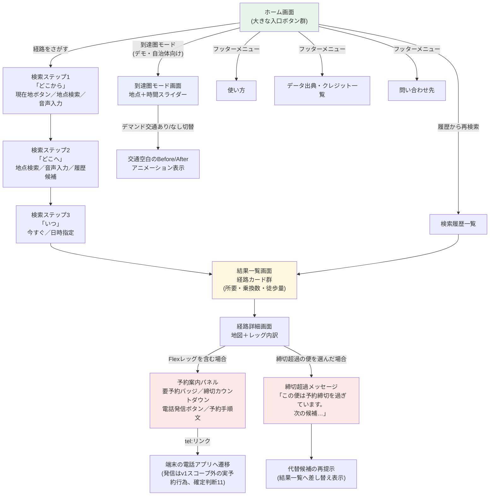

# UI/UX要件定義書 — ノリシロ

**状態: 完了（設計確定。W7成果物）**
**作成日: 2026-07-02**
**対象読者: `apps/web`の実装を担当するClaude Code（VSCode）／レビューを行う開発者／審査デモの脚本を作る担当者**

本書は`08_作業計画_WBS.md`のW7（`docs/15_UIUX要件定義.md`）に対応する成果物であり、ユーザーが確定した設計判断（本書冒頭の依頼文に列挙された11項目）を正典として体系化・肉付けしたものである。設計判断そのものの変更・追加提案は行わず、別途「10. 代替案・未決事項」節に分離して記載する。本書はネットワーク調査を伴わず、既存資料（`05_アイデア提案.md`、`06_合体案_ノリシロxMCP_低コスト構成.md`、`07_瑞穂町Flexデータ検分.md`、`10_GTFS-Flex実装仕様.md`、`11_アーキテクチャ設計.md`、`13_ルーティングエンジン設計.md`、`02_審査基準_審査員分析.md`）との整合を取ることに専念する。

`08_作業計画_WBS.md`が示す全体計画では、本書はI-3（Web UI骨格）・I-8（予約締切リマインド・音声入力・多言語）・I-9（磨き込み・アクセシビリティ検証）の各実装フェーズが直接参照する要件書として位置づけられる。ルーティング結果の型定義・isochrone APIの契約は`13_ルーティングエンジン設計.md`（8章）が正であり、本書はその出力を「どう見せるか」というプレゼンテーション層の観点でのみ扱う。MCPサーバーのツール仕様は`14_MCPサーバーAPI仕様.md`（W6、未着手）の管轄であり、本書のUIはMCP経路とは独立したWebアプリ経路（`11_アーキテクチャ設計.md` 3章(a)）のみを対象とする。

---

## 目次

1. [ペルソナとユースケースシナリオ](#1-ペルソナとユースケースシナリオ)
2. [情報設計・画面フロー](#2-情報設計画面フロー)
3. [画面別要件](#3-画面別要件)
4. [Flexレッグ表示仕様](#4-flexレッグ表示仕様)
5. [アクセシビリティ要件チェックリスト](#5-アクセシビリティ要件チェックリスト)
6. [音声入出力仕様](#6-音声入出力仕様)
7. [ビジュアルデザイン方針](#7-ビジュアルデザイン方針)
8. [計測方針](#8-計測方針)
9. [審査デモ演出要件](#9-審査デモ演出要件)
10. [代替案・未決事項](#10-代替案未決事項)

---

## 1. ペルソナとユースケースシナリオ

### 1.1 主ペルソナ（確定判断1）

| # | ペルソナ | 特徴 | UI要件への含意 |
|---|---|---|---|
| ① | 高齢者本人 | スマホ操作に不慣れ。小さい文字・複雑な入力・多段階の選択に弱い。デマンド交通の存在自体を知らないことが多い | ガイド型UI（確定判断2）、文字サイズ切替（5章）、電話発信ボタン（4章） |
| ② | 遠方の家族 | 親の移動を代理検索する。親の自宅・目的地・移動能力を把握しているが、親の住む地域の交通事情には詳しくない | 履歴からの再検索、分かりやすい経路カード、予約手順を「親に伝えられる」平易な文章 |
| ③ | 地方を訪れる観光客 | 土地に不案内。多言語ニーズがある（v1は日本語のみ、8章参照）が、まずは迷わない操作性が優先 | 現在地ボタン、地図中心のUI、シンプルな3ステップ |

審査員向けデモの分かりやすさも要件として扱う（②③の体験は審査員が最初に触れる体験そのものであるため、1.2節の3シナリオは審査ヒアリング・表彰式プレゼンの脚本の土台にもなる）。

### 1.2 ユースケースシナリオ（3本）

各シナリオは「予約締切に間に合う」「間に合わない」の両パターンを含める。時刻・数値はすべて実データ（瑞穂町「チョイソコみずほまち」、`07_瑞穂町Flexデータ検分.md` / `10_GTFS-Flex実装仕様.md` 2.4節 / `13_ルーティングエンジン設計.md` 10.1節で検証済み）に基づく。

#### シナリオA: 瑞穂町の高齢者の通院（本人利用）

**登場人物**: 瑞穂町在住、80代女性。スマートフォンは家族に勧められて持たされたが、電話とLINE以外はほとんど使わない。

**背景**: 火曜日の朝、10:00に「みずほ病院」で診察の予約が取れている。自宅は「殿ケ谷会館」の近くで、車の運転はしていない。

**パターンA-1（間に合う）**:
1. 朝9:00、自宅でアプリを開く。ホーム画面の大きなボタン「どこから」を押す。
2. 「現在地を使う」ボタンを押す（GPSで自宅位置を取得）。
3. 「どこへ」で「みずほ病院」と入力（漢字入力が不安なため、音声入力ボタンを使って「みずほびょういん」と話す）。
4. 「いつ」で「今すぐ」を選択（既定値）。
5. 結果一覧に経路カードが表示される。カードには「要予約」バッジと「予約締切: 09:30まで」の残り時間カウントダウン（表示時点で残り30分）が出る。
6. カードを開くと、電話発信ボタンと「予約手順」の平易な文章が表示されている。ボタンを押すと発信画面に遷移し、050-2030-2630に電話をかけ、10:00にみずほ病院へ行きたい旨を伝える。
7. 予約が取れたら、そのままアプリの画面をカードごと家族にLINEで送って共有できる（家族が状況を把握できる）。

**パターンA-2（間に合わない）**:
1. 同日9:45に同じ検索をした場合、経路カードのFlexレッグ部分に「この便は予約締切を過ぎています。次の候補をご案内します」という表示が出て、10:00発の便は候補から外れる。
2. 代わりに、時間窓（9:00〜17:00）の範囲内で予約可能な後続の時間帯（例: 現在時刻+30分後以降に出発可能な便）が代替候補として提示される。
3. 本人は「今日はもう間に合わない」と判断し、病院に電話をして予約時間の変更を依頼する（アプリはこの電話番号案内までを担う。予約実行そのものはv1スコープ外、確定判断11）。

#### シナリオB: 遠方の家族の代理検索

**登場人物**: 瑞穂町の実家に住む母親（シナリオAと同一人物）を持つ、都内在住の40代男性。

**背景**: 母親から「今度病院に行きたいけど、バスがあるかわからない」と電話で相談を受けた。本人はスマホ操作に慣れているが、瑞穂町のデマンド交通の存在は知らなかった。

**パターンB-1（事前に調べて安心させる、間に合うケース）**:
1. 電話中にその場でアプリを開き、「どこから」に母の自宅最寄りの停留所名を入力（現在地ボタンは自分の位置になるため使わず、地点検索を使う）。
2. 「どこへ」に「みずほ病院」、「いつ」に来週火曜10:00を指定。
3. 結果に「要予約」のデマンド交通の経路が出て、予約締切（発車30分前）と電話番号、平易な予約手順の文章が表示される。
4. 息子は電話でその手順を母に読み上げて伝える。「お母さん、火曜の朝、9時半までにこの番号（050-2030-2630）に電話すればいいみたいだよ」。
5. 履歴に検索結果が残るため、当日また同じ検索をやり直さず「履歴から再検索」で呼び出せる。

**パターンB-2（間に合わないと分かり、代替手段を一緒に考える）**:
1. 母から「もう明日の話なんだけど」と相談された想定で、当日の残り時間が予約締切（30分前）を割っている時間帯に検索。
2. 経路カードに「この便は予約締切を過ぎています」の表示と代替候補（時間をずらした便、または他の交通手段があれば併記）が出る。
3. 息子はこの表示をそのまま見て、母に「今日はデマンド交通は使えないから、明日にしよう」と伝えられる。誤解を招く「予約できました」的な表示が一切出ないため、息子が母に誤った安心感を伝えるリスクがない（確定判断11）。

#### シナリオC: 白馬村観光客

**登場人物**: 白馬村を訪れた30代の観光客（国内旅行者）。土地に不案内で、レンタカーは使わずローカルの交通手段で移動したい。

**背景**: 宿泊先から日帰り温泉施設に行きたいが、路線バスの本数が少なく、地元の交通事情に詳しくない。

注記: 白馬村の実際のGTFS-Flexデータはチャレンジ限定データであり本書作成時点では未検分（`11_アーキテクチャ設計.md` 8章未決事項4参照）。以下は瑞穂町データで検証済みの表示パターン・操作フローを白馬村の文脈に当てはめた想定シナリオであり、実際の予約締切分数・電話番号・時間窓は白馬村データ入手後に差し替える。

**パターンC-1（間に合う）**:
1. 宿泊先で「どこから」を「現在地を使う」で取得、「どこへ」を検索窓で「温泉施設名」を入力。
2. 結果一覧に固定路線バス＋デマンド交通を組み合わせた経路カードが複数表示され、所要時間・乗換数・徒歩量で比較できる。
3. デマンド交通を含む経路を選ぶと「要予約」バッジと締切カウントダウンが見え、電話番号が地元事業者のものであることが分かる（言語の壁があっても電話番号・時刻・地図だけで最低限行動できる設計、6章参照）。
4. 締切に余裕があるため電話をかけて予約し、地図上でエリア表示（確定判断4の面表現）を見ながら乗車予定地点へ向かう。

**パターンC-2（間に合わない）**:
1. 締切を過ぎた時間帯に検索すると、同様に「予約締切を過ぎています。次の候補…」の表示に切り替わり、固定路線バスのみの代替経路、または翌日以降の便が提示される。
2. 観光客はスケジュールを組み直すか、固定路線バスでの移動に切り替える判断ができる。

---

## 2. 情報設計・画面フロー

### 2.1 全体フロー（Mermaid）



### 2.2 画面一覧と位置づけ

| # | 画面 | 役割 | 主対象ペルソナ |
|---|---|---|---|
| S1 | ホーム | 全ての入口。大ボタンで迷わせない | 全員 |
| S2 | 検索ステップ1〜3 | 「どこから」「どこへ」「いつ」を1問1答式に聞く | ①③（②は履歴・地点検索を多用） |
| S3 | 結果一覧 | 経路カードの比較 | 全員 |
| S4 | 経路詳細 | 地図＋レッグ内訳の確認 | 全員 |
| S5 | 予約案内パネル | Flexレッグの予約導線 | ①②（電話をかける・かけ方を伝える） |
| S6 | 検索履歴 | 再検索の起点 | ②（代理検索の繰り返し） |
| S7 | 到達圏モード | 自治体・審査員向けデモ | 審査員・自治体職員（エンドユーザーには任意機能） |
| S8 | 使い方 | 初回利用者のオンボーディング | ①③ |
| S9 | データ出典・クレジット一覧 | ライセンス遵守（`09_固定路線データ調査.md` 7.3節の方針を継承） | 審査員・データ提供者 |
| S10 | 問い合わせ先 | 応募規約対応（後述2.3節） | 審査員・データ提供者・利用者 |

### 2.3 必須ページの位置づけ（確定判断10）

`01_開催概要_募集要項.md`の応募条件・規約に「作品内に**問い合わせ先を明記**（データ提供者へ問い合わせが行かないように）」という規定が明記されている。S10（問い合わせ先）はこの規定に直接対応する必須ページであり、フッターから常に1タップで到達できる場所に配置する（3.9節）。S9（データ出典・クレジット一覧）は`09_固定路線データ調査.md`が定めるフィードごとのライセンス表記義務、および`12_データパイプライン設計.md`が生成する「クレジット生成」ステージの出力（feeds.yamlから出典一覧JSON）を表示する画面であり、`list_data_sources`相当の内容をエンドユーザー向けに整形して見せる（3.9節）。

---

## 3. 画面別要件

各画面は「目的／表示要素／操作／状態変化／エラー状態／空状態」の順で記述する。ワイヤーフレームはASCII記述とする。

### 3.1 S1: ホーム画面

**目的**: 迷わず「経路をさがす」に入れること。次点で到達圏モード・使い方・出典への導線を提供する。

```
+--------------------------------------+
|  [ロゴ/アプリ名]      [文字サイズ Aa] |
|                                        |
|     ノリシロ                          |
|  その町、クルマがなくても行けます      |
|                                        |
|  +----------------------------------+ |
|  |     経路をさがす        [>]      | |  ← 最大の主ボタン
|  +----------------------------------+ |
|                                        |
|  +----------------------------------+ |
|  |  履歴から再検索          [>]      | |  ← 履歴が0件なら非表示（3.1 空状態）
|  +----------------------------------+ |
|                                        |
|  +----------------------------------+ |
|  |  到達圏マップ(デモ)      [>]      | |  ← 3.7節。エンドユーザー向けには
|  +----------------------------------+ |     控えめな導線で良い
|                                        |
| --------------------------------------|
| [使い方] [データ出典] [お問い合わせ]   |  ← フッター、常時表示
+--------------------------------------+
```

**表示要素**: アプリ名・一言コピー、主ボタン「経路をさがす」、履歴ボタン（履歴があるときのみ）、到達圏モードへの導線、フッター3リンク（使い方／データ出典／問い合わせ先）、文字サイズ切替。

**操作**: 各ボタンはタップ（またキーボードのTab＋Enter）で次画面へ。

**状態変化**: 初回起動時は「使い方」を軽く促すツールチップを1回だけ出す（既読管理はlocalStorage、確定判断9のオフライン方針と整合しサーバー送信なし）。

**エラー状態**: なし（ホームは通信を発生させない静的画面）。

**空状態**: 履歴が0件の場合は「履歴から再検索」ボタンを非表示にする（存在するが空、という中途半端な表示を避ける）。

### 3.2 S2: 検索ステップ1〜3（ガイド型フォーム）

**目的**: 「どこから」「どこへ」「いつ」を1画面1問で順に聞き、高齢者・不案内な観光客でも迷わせない（確定判断2、チャットではなくガイド型UI）。

```
ステップ1/3
+--------------------------------------+
|  < 戻る                    1/3       |
|                                        |
|   どこから出発しますか？               |
|                                        |
|  +----------------------------------+ |
|  |  📍 現在地を使う                  | |  ← 最有力候補として最上部・最大
|  +----------------------------------+ |
|                                        |
|  +----------------------------------+ |
|  |  🔍 地点を入力      [🎤音声入力]  | |  ← 音声ボタンは対応ブラウザのみ表示
|  +----------------------------------+ |
|                                        |
|  最近の検索地点:                       |
|  ・ 殿ケ谷会館                         |
|  ・ 瑞穂町役場                         |
|                                        |
+--------------------------------------+
```

ステップ2（「どこへ」）・ステップ3（「いつ」）も同一レイアウト構造を踏襲する。ステップ3は「今すぐ」ボタンを最上位候補に、日時指定はその下に控えめに配置する（既定値で1タップ完了できることを優先）。

**表示要素**: 進捗表示（1/3等）、質問文（大きい文字）、主要な回答手段を大ボタンで並べる、補助的な入力手段（検索窓・音声）、直近の履歴からの候補（②家族が過去に検索した地点も含まれるため代理検索を助ける）。

**操作**: ボタンタップで即時に次ステップへ進む（確認ボタンを介さない、1操作1遷移）。地点入力はあいまい検索（部分一致・読み仮名対応）。「戻る」で前ステップに戻れる。

**状態変化**: 現在地取得中はボタンにローディング表示（「取得中…」）を出す。地点入力中は候補をインクリメンタルに表示。

**エラー状態**:
- 現在地取得が失敗（位置情報の許可拒否・タイムアウト）した場合: 「現在地を取得できませんでした。地点を入力してください」と表示し、検索窓にフォーカスを移す。ブロッキングなアラートではなく、その場に留まる形の案内にする。
- 地点入力で該当地点が見つからない場合: 「一致する地点が見つかりません。別のキーワードでお試しください」。

**空状態**: 履歴（最近の検索地点）が0件の場合はその欄自体を非表示にする。

### 3.3 S3: 結果一覧画面

**目的**: 複数の経路候補を「所要・乗換数・徒歩量」で比較し、Flexレッグを含む経路は要予約であることを一目で分からせる。

```
+--------------------------------------+
|  < 戻る    殿ケ谷会館 → みずほ病院    |
|                                        |
|  +----------------------------------+ |
|  | 所要 13分   乗換 0回  徒歩 少     | |
|  | 🚐 要予約  締切まで あと30分       | |  ← 4章で詳述するバッジ
|  |                          [詳細>] | |
|  +----------------------------------+ |
|                                        |
|  +----------------------------------+ |
|  | 所要 42分   乗換 1回  徒歩 中     | |
|  | 🚌 固定路線バスのみ                | |
|  |                          [詳細>] | |
|  +----------------------------------+ |
|                                        |
+--------------------------------------+
```

**表示要素**: 検索条件の要約（出発地→目的地、常に表示して見失わせない）、経路カード群（所要時間・乗換数・徒歩量の3指標を常に同じ位置に表示し比較しやすくする）、Flexレッグを含むカードには要予約バッジと締切カウントダウンをカード表面から見せる（詳細画面まで進まないと分からない設計にはしない）。

**操作**: カードタップで経路詳細画面へ。並び替え（所要時間順・乗換数順等）は補助的な操作として提供するが既定は所要時間昇順。

**状態変化**: 検索完了直後はカードが上から順にフェードインする程度の演出は許容するが、必須要件ではない。

**エラー状態**:
- 経路探索が0件（本当に手段がない）: 3.3節「空状態」で扱う。
- シャード取得に失敗（オフライン・オンライン復帰待ち、`11_アーキテクチャ設計.md` 3章(a)のオフライン動作）: 「この地域のデータをまだ取得できていません。電波の良い場所で再度お試しください」と表示し、再試行ボタンを出す。

**空状態（経路が見つからない場合）**: 「この条件では経路が見つかりませんでした」に加え、検索条件（時間帯や出発地点）を変えることを提案する文言を添える。交通空白そのものが可視化された結果である可能性があるため、単なるエラーではなく「この地域は現在データが提供されていない、または本当に交通手段が乏しい可能性があります」という誠実な説明を添える（`06_合体案`が明言する「データが無い地域は無いなりに表示」という思想をエラー文言レベルでも継承する）。

### 3.4 S4: 経路詳細画面

**目的**: 選んだ経路の地図表示とレッグ単位の内訳を確認する。Flexレッグがあれば予約案内パネル（3.5節）へ自然に接続する。

```
+--------------------------------------+
|  < 戻る          経路の詳細            |
|                                        |
|  [====== 地図表示エリア ======]        |
|  [  ポリライン＋Flexエリアの面表現  ]  |
|  [                              ]      |
|                                        |
|  09:00  殿ケ谷会館                     |
|    | 🚐 デマンド交通(要予約) 約13分     |
|  09:13  みずほ病院                     |
|                                        |
|  +----------------------------------+ |
|  |  ▼ 予約について見る                | |  ← タップで3.5節パネルを展開
|  +----------------------------------+ |
+--------------------------------------+
```

**表示要素**: 地図（MapLibre GL JS＋地理院タイル）、固定路線レッグはポリライン表示、Flexレッグは「エリア内どこでも乗降可」を示す面表現（location_group停留所群のconvex hull的表示、確定判断4。`13_ルーティングエンジン設計.md` 7.3節のisochroneポリゴン生成方式（凸包）と実装上の考え方を揃える）、レッグごとの時刻・手段・所要時間のリスト。

**操作**: 地図はピンチズーム・パン操作可能。「予約について見る」タップで予約案内パネルを展開（3.5節）。

**状態変化**: パネル展開時はスクロール位置がパネル先頭に移動し、電話ボタンが見える位置まで自動スクロールする。

**エラー状態**: 地図タイルの取得に失敗した場合、地図部分は簡易なグレー表示＋「地図を表示できません」に縮退するが、レッグのテキスト情報（時刻・所要時間）は地図の成否に関係なく表示され続ける（地図が主、テキストが従にならないようにする）。

**空状態**: 該当なし（経路が選択された前提の画面のため）。

### 3.5 S5: 予約案内パネル（Flexレッグ）

3.4節から展開されるパネル。詳細な表示内容・コピー文言は4章で規定する。

### 3.6 S6: 検索履歴一覧

**目的**: ②家族の代理検索や、①本人の通院のような定期的な移動を素早く再検索できるようにする。

```
+--------------------------------------+
|  < 戻る          検索履歴              |
|                                        |
|  殿ケ谷会館 → みずほ病院               |
|  火曜 10:00発                [再検索] |
|                                        |
|  自宅 → 瑞穂町役場                     |
|  先週の検索                  [再検索] |
+--------------------------------------+
```

**表示要素**: 過去の検索条件（出発地・目的地・希望時刻）の一覧、各項目に「再検索」ボタン。

**操作**: 「再検索」タップで、出発地・目的地は保持し「いつ」だけ「今すぐ」に更新した状態で結果一覧へ直接遷移する（3ステップを毎回やり直させない）。履歴項目の削除操作も提供する。

**状態変化**: 削除操作後はその場でリストから除去（一覧の再取得は発生しない、全てlocalStorage内の操作）。

**エラー状態**: 該当なし（ローカルデータのみで完結する画面）。

**空状態**: 履歴が0件の場合「まだ検索履歴がありません」と表示し、「経路をさがす」への導線を添える。

### 3.7 S7: 到達圏モード（デモ・自治体向け）

**目的**: 地点＋時間スライダーで到達可能範囲をアニメーション表示し、「デマンド交通あり/なし」の切替で交通空白の変化を見せる（確定判断8、審査プレゼンの山場。9章で詳述）。

```
+--------------------------------------+
|  < 戻る        到達圏マップ            |
|                                        |
|  地点: [ 瑞穂町役場          ▼]       |
|                                        |
|  [====== 地図表示エリア ======]        |
|  [   到達圏ポリゴンのオーバーレイ  ]   |
|                                        |
|  時間: 0分 -----●----------- 60分     |  ← スライダー
|                  30分                  |
|                                        |
|  [ デマンド交通: ON ] [ OFF ]          |  ← トグル、9章のBefore/After
+--------------------------------------+
```

**表示要素**: 基準地点の選択、時間スライダー（0〜60分程度を想定、`13_ルーティングエンジン設計.md` 8章の`isochrone`APIの`cutoffs`引数に対応）、地図上への到達圏ポリゴンの重ね描き、「デマンド交通あり/なし」切替トグル。

**操作**: スライダーをドラッグすると到達圏ポリゴンがリアルタイムに拡大・変化する。トグル切替で同じ基準地点・同じ時間設定のまま到達圏の差分を見せる。

**状態変化**: スライダー操作中は滑らかなアニメーション（ポリゴンの補間表示）を優先する。トグル切替時は「デマンド交通なし」の到達圏（固定路線のみ）から「あり」の到達圏（Flexレッグ込み）への変化を、色や透明度の差で分かりやすく示す。

**エラー状態**: 該当地域のシャードが未提供（Flexデータがない地域）の場合、「デマンド交通あり」トグルを無効化し「この地域のデマンド交通データは現在提供されていません」と明示する（データが無いことも可視化するという`06_合体案`の思想をここでも継承）。

**空状態**: 該当なし（基準地点選択が前提の画面）。

### 3.8 S8: 使い方

**目的**: 初回利用者（特に①③）が迷わず使い始められるようにする。

**表示要素**: 3ステップ検索の説明、Flexレッグ（要予約バッジ）の意味の説明、音声入力の使い方（対応ブラウザの場合）、文字サイズ・高コントラストモードの切替場所の案内。テキストと簡単な図解（アイコン＋短文）中心とし、動画は必須要件としない。

**操作**: 通常の縦スクロール読み物。各セクションへのジャンプリンクを設けてもよい。

**状態変化・エラー状態・空状態**: 該当なし（静的コンテンツ）。

### 3.9 S9: データ出典・クレジット一覧 ／ S10: 問い合わせ先

**目的（S9）**: 利用しているデータの出典・ライセンスを明示する（`09_固定路線データ調査.md`が定める表記義務、`12_データパイプライン設計.md`のクレジット生成ステージの出力の表示先）。`list_data_sources`相当の内容として、フィードごとの提供元・ライセンス種別（CC BY 4.0／公共交通オープンデータ基本ライセンス／チャレンジ限定ライセンス）・データ取得日を一覧化する。

**目的（S10）**: `01_開催概要_募集要項.md`の応募条件が定める「作品内に問い合わせ先を明記（データ提供者へ問い合わせが行かないように）」に対応する。開発者自身の問い合わせ先（メールアドレス等）を明示し、利用者からの不具合報告・自治体からの問い合わせがデータ提供元（瑞穂町、9自治体、GTFSデータリポジトリ運営等）に誤って向かうことを防ぐ。

**表示要素（共通）**: フッターから1タップで到達できるリンク、簡潔な一覧・テキスト表示。

**操作**: 通常の縦スクロール読み物。S9はライセンスごとにグルーピングした一覧表示、S10は問い合わせ手段（メールリンク等）を明示する。

**状態変化・エラー状態・空状態**: 該当なし（静的コンテンツ、`12_データパイプライン設計.md`のビルド時に生成されるクレジットJSONを表示するのみ）。

---

## 4. Flexレッグ表示仕様

Flexレッグ（GTFS-Flexで表現されるデマンド交通区間）は、経路カード（S3）と経路詳細画面（S4）の両方で必ず「要予約」であることが伝わるようにする（確定判断3）。本節のコピー文言例はすべて瑞穂町「チョイソコみずほまち」の実データ値（`booking_rules.txt`, `stop_times.txt`, `07_瑞穂町Flexデータ検分.md`, `10_GTFS-Flex実装仕様.md` 2.4節, `13_ルーティングエンジン設計.md` 10.1節で検証済みの値）を用いる。他自治体のデータに差し替える際は、同じテンプレート構造のまま値のみ置換する。

### 4.1 表示要素の一覧

Flexレッグには以下を必ず表示する。

| 要素 | 内容 | 表示場所 |
|---|---|---|
| 要予約バッジ | 「🚐 要予約」等、色だけに依存しないアイコン＋テキストの組み合わせ（5章のアクセシビリティ要件） | 経路カード表面（S3）、経路詳細のレッグ行（S4） |
| 予約締切カウントダウン | 発車希望時刻から`prior_notice_duration_min`分を引いた締切時刻までの残り時間 | 経路カード表面（S3）、予約案内パネル（S5） |
| 電話発信ボタン（tel:リンク） | `booking_rules.phone_number`をそのまま`tel:`スキームのリンクにする | 予約案内パネル（S5） |
| 予約手順の平易な文章 | `booking_rules.message`の自由文＋構造化情報（締切時刻の具体値）を並記した平易な説明 | 予約案内パネル（S5） |

### 4.2 経路カード表面（S3）でのコピー文言例

**締切に余裕がある場合（パターンA-1、探索基準時刻09:00、締切09:30）**:

```
🚐 要予約　予約締切まで あと30分
```

**締切が近い場合（残り10分未満、視覚的な強調を切り替える閾値の例）**:

```
🚐 要予約　予約締切まで あと8分
```

**締切を過ぎている場合（パターンA-2、探索基準時刻09:45、締切09:30）**:

このケースでは経路カード自体を通常候補として出さず、3.3節の「代替候補」側に回すか、下記のような打ち切り表示にする。

```
🚐 この便は予約締切を過ぎています
　　次の候補をご案内します
```

### 4.3 予約案内パネル（S5）でのコピー文言例

```
+--------------------------------------+
|  🚐 デマンド交通（要予約）             |
|                                        |
|  殿ケ谷会館 → みずほ病院               |
|  希望発車: 火曜 10:00                  |
|                                        |
|  予約締切: 09:30 まで                  |
|  （現在9:00、あと 30分）               |
|                                        |
|  --------------------------------      |
|  ご利用の30分前までに予約が必要です。   |
|  電話予約は8:30から16:30まで、         |
|  オンライン予約は24時間受付です。       |
|  --------------------------------      |
|                                        |
|  +----------------------------------+ |
|  |  📞 050-2030-2630 に電話する      | |  ← tel:050-2030-2630
|  +----------------------------------+ |
|                                        |
|  電話をかけたら、こう伝えてください：   |
|  「火曜日の朝10時に、殿ケ谷会館から      |
|   みずほ病院まで乗りたいです」          |
|                                        |
|  ※ この画面から予約は完了しません。     |
|  　電話（または案内先サイト）で         |
|  　直接お申し込みください。             |
+--------------------------------------+
```

**文言設計の要点**:
- 締切時刻は「09:30まで」という具体値と「あと30分」という相対値の両方を必ず併記する（具体値だけでは今の時刻との比較を利用者に強いる、相対値だけでは時計を見て確認しづらい、という2つの弱点を補い合う設計）。
- `message`列の自由文（電話受付時間帯8:30-16:30の情報が構造化列に存在しない、`10_GTFS-Flex実装仕様.md` 2.4.1節・3.4節の指摘）は、締切時刻の計算結果と並べて両方見せる（片方だけでは情報が不完全になるため）。
- 「電話をかけたら、こう伝えてください」の一文で、出発地・目的地・希望時刻を利用者自身の言葉で言わなくても伝えられる例文を用意する。これは①高齢者本人が電話口で緊張して用件を言い忘れる、②家族が本人に電話のかけ方を伝える、両方の場面を助ける。
- 末尾の「※ この画面から予約は完了しません」は確定判断11（予約の実行はv1スコープ外、誤解を生む「予約完了」的表現の禁止）に対応する必須文言。全てのFlexレッグ予約案内パネルに例外なく表示する。

### 4.4 締切超過時の代替提示（S3・S4共通）

```
この便は予約締切を過ぎています。次の候補…

🚐 火曜 10:30発でしたら、あと45分（09:45まで）に
   ご予約いただければご利用いただけます

または

🚌 固定路線バスでの代替経路もご案内できます（所要42分）
```

**設計の要点**: 「次の候補」は必ず何らかの代替（時間をずらしたFlex便、固定路線の代替経路、いずれも無い場合は3.3節の空状態文言）を提示し、単に「利用できません」で終わらせない。これは②家族が代理検索した際に、次に何をすべきか（電話をかけて調整する／別の時間にする／別の手段を使う）が分かる状態を維持するための要件である。

### 4.5 電話発信ボタンの実装要件

- `tel:`スキームのリンク（`<a href="tel:050-2030-2630">`相当）とし、タップで端末標準の電話アプリに遷移する。アプリ内で発信処理を代行しない（OSの標準動作に委ねる）。
- ボタンはタップ領域として最小44px角を確保する（7章のタップ領域要件）。
- 電話番号の表示は`050-2030-2630`のように読みやすいハイフン区切り表記を用いる（`booking_rules.phone_number`の値をそのまま構造化データとして保持しつつ、表示時に整形する）。
- `booking_url`列が空文字の場合（瑞穂町の実データがこの状態、`07_瑞穂町Flexデータ検分.md` 3.4節）、オンライン予約ボタンは表示しない（存在しないリンク先へのボタンを出さない）。`message`に「オンライン予約は24時間受付」という案内文があっても、実際のURLが特定できない場合は電話予約のみを主たる導線として案内する。

---

## 5. アクセシビリティ要件チェックリスト

WCAG 2.1 AA準拠を目標とする（確定判断6）。

### 5.1 視覚

- [ ] 文字サイズ切替（標準／大／特大の3段階）をヘッダーから常時アクセス可能にする。
- [ ] 高コントラストモードを提供し、切替はホーム画面・設定から1操作で行える。
- [ ] テキストと背景のコントラスト比は通常テキストで4.5:1以上、大きな見出し等では3:1以上を確保する（WCAG 2.1 AA 1.4.3準拠）。
- [ ] 色だけに依存しない情報伝達（確定判断6）: 要予約バッジは色に加えてアイコン・テキストラベルを併用する（4.1節）。到達圏モードのBefore/After（9章）も色差に加えてポリゴンの透明度・パターンの差を併用する。
- [ ] 画像・アイコンにはaltテキストまたはaria-labelを付与する。

### 5.2 スクリーンリーダー・ARIA対応

- [ ] 各画面の主要見出しに適切なランドマーク（`role="main"`、見出しレベルの階層構造）を付与する。
- [ ] ガイド型フォーム（S2）の各質問は`aria-live`等で進捗（1/3等）と質問文を読み上げ順に伝える。
- [ ] 経路カード（S3）は要予約バッジ・締切カウントダウン・所要時間等の情報がスクリーンリーダーで読み上げ順に理解できる構造（適切な見出し・リスト構造）にする。
- [ ] 電話発信ボタン（4章）は「050-2030-2630に電話する」のように、リンク先が電話番号であることが読み上げで明確に伝わるラベルにする。
- [ ] 地図（MapLibre GL JS）はキャンバス/Canvas系描画になりうるため、地図に依存しない代替情報（レッグのテキストリスト、3.4節）を必ず並置し、スクリーンリーダー利用者が地図を読めなくても経路情報を取得できるようにする。

### 5.3 キーボード操作

- [ ] 全ての操作（3ステップ検索、経路カード選択、予約案内パネルの展開、電話ボタン、到達圏モードのスライダー・トグル）がキーボードのみで完結できる（確定判断6）。
- [ ] フォーカス順序は画面の視覚的な読み順と一致させる。
- [ ] フォーカスが当たっている要素は視覚的に明示（フォーカスリング等）される。
- [ ] モーダル・パネル（予約案内パネル等）を開いた際はフォーカスをパネル内に移動し、閉じた際は元の要素にフォーカスを返す。

### 5.4 タップ・操作領域

- [ ] タップ領域は最小44px角を確保する（7章と共通の基準、電話ボタン・主要ボタン・スライダーのハンドル等すべてに適用）。
- [ ] ガイド型フォームの主要ボタン（現在地ボタン・今すぐボタン等）は特に大きめのタップ領域（44pxを上回るサイズ）を確保し、①高齢者本人の誤操作を減らす。

### 5.5 認知・言語

- [ ] 平易な言葉遣いを徹底する（4.3節の予約手順コピー文言例が示す水準）。専門用語（「Flexレッグ」「location_group」等の内部用語）はエンドユーザー向け表示に一切出さない。
- [ ] 1画面1問（S2）、1操作1遷移の原則を守り、認知負荷を最小化する。
- [ ] エラーメッセージ（3章各節）は「何が起きたか」「次に何をすればよいか」の両方を含む文にする。

---

## 6. 音声入出力仕様

確定判断5に基づく。

### 6.1 音声入力

- **技術**: Web Speech API（`SpeechRecognition`）。端末内認識（対応ブラウザの実装に依存、`11_アーキテクチャ設計.md` 6章の対応ブラウザ方針と同一のEvergreenブラウザを前提）。
- **対応範囲**: 出発地・目的地の地点入力（S2ステップ1・2）に音声入力ボタンを提供する。日時（ステップ3）は選択肢がボタン中心のため音声入力の必要性が低く、v1では対象外とする。
- **フォールバック**: `SpeechRecognition`が`window`に存在しないブラウザでは音声入力ボタン自体を表示しない（非表示、無効化グレーアウトではない。存在しない機能への言及は利用者を混乱させるため）。機能検出は起動時に1回行い、以後の画面遷移で再検出しない。
- **エラー処理**: 認識に失敗した場合（無音・雑音・非対応言語の発話等）は「うまく聞き取れませんでした。もう一度お試しいただくか、文字で入力してください」と案内し、通常の検索窓入力にフォールバックできる状態を維持する。

### 6.2 音声読み上げ（Speech Synthesis）

- **技術**: Web Speech Synthesis API（`SpeechSynthesis`）。
- **対応範囲**: 経路カード・経路詳細・予約案内パネルの主要情報（所要時間、要予約の有無、締切時刻、電話番号）を読み上げボタンで再生できるようにする。①高齢者本人が画面を見ながらでも、見落としを音声で補完できることを狙う。
- **フォールバック**: `SpeechSynthesis`が非対応のブラウザでは読み上げボタンを非表示にする（6.1節と同じ思想）。
- **スクリーンリーダーとの関係**: Speech Synthesisによる明示的な読み上げボタンと、OS/ブラウザのスクリーンリーダー（5.2節）は独立した機能であり、片方の実装が他方を代替しない。両方を並行して要件化する。

---

## 7. ビジュアルデザイン方針

派手さより「迷わない」ことを優先する（確定判断1・2の思想を視覚面でも継承）。

### 7.1 配色

- 基本トーンは低彩度・高コントラストを基調とし、①高齢者にも③観光客にも視認しやすい配色にする。
- Flexレッグ（デマンド交通）を示す色は固定路線バス・鉄道と明確に区別できる色相を割り当てるが、5.1節の通り色だけに依存させず、必ずアイコン・テキストを併用する。
- 締切が近い（例: 残り10分未満）状態は警戒色（オレンジ系等）で強調するが、これも色単独ではなくテキスト（「あと8分」等の具体値）を必ず併記する。

### 7.2 タイポグラフィ

- 本文の既定文字サイズは大きめに設定し、5.1節の「標準／大／特大」の3段階切替の「標準」自体を一般的なWebアプリより一段階大きい値に設定する（①高齢者が「標準」のまま使っても読める水準を既定とする）。
- 見出しと本文のサイズ差を明確にし、視線の誘導を助ける。
- 数字（所要時間・締切時刻・電話番号）は特に判読性の高い字形・十分な字間を確保する。

### 7.3 タップ領域

- 最小44px角（5.4節・4.5節と共通の基準）をアプリ全体のボタン・リンク・スライダーハンドルに適用する。
- ボタン間の間隔も誤タップを避けるため十分に確保する（隣接ボタンとの間隔は44px未満に詰めない）。

### 7.4 レイアウト

- 1画面1問・1操作1遷移（5.5節）を視覚レイアウトでも徹底し、1画面内に複数の主要アクションを並列させない。
- 経路カード（S3）は所要時間・乗換数・徒歩量の3指標を常に同じ位置・同じ順序で表示し、複数カードを見比べる際の視線移動を最小化する。
- 地図と情報パネルが同時に必要な画面（S4・S7）でも、地図に依存しないテキスト情報を必ず地図の付近に併置する（5.2節と同じ理由）。

---

## 8. 計測方針

プライバシー配慮を最優先とする。

- **外部アナリティクスサービスは導入しない**（Google Analytics等の第三者送信を行うSDK・タグは一切組み込まない）。
- **個人情報・位置情報を外部送信しない**方針を明文化する。現在地情報（位置情報）はブラウザのGeolocation APIから取得した後、シャードID解決（`11_アーキテクチャ設計.md` 3章(a)）とルーティング計算のためにクライアント側（Web Worker）でのみ使用し、サーバーへ送信しない。検索履歴・設定はlocalStorageにのみ保存し、サーバーには一切送信しない（`11_アーキテクチャ設計.md` 5章「利用者データの扱い」の確定判断5を継承）。
- **計測を行う場合の選択肢**: 「アナリティクスなし」を既定方針とし、必要であれば自前の最小カウント（例: GitHub Actions側で集計するCDNアクセスログの集計程度、個々の利用者を特定しない集計値のみ）に限定する。個々の検索クエリの内容・出発地/目的地の組み合わせ・位置情報そのものをログとして外部保存することは行わない。
- **この方針の掲示場所**: 8章の方針は使い方（S8）またはデータ出典・クレジット一覧（S9）の付近に、平易な一文（例: 「このアプリは、あなたの検索内容や現在地を外部に送信しません」）として明示する。

---

## 9. 審査デモ演出要件

`02_審査基準_審査員分析.md`が示す通り、UI/UX面の完成度は公式の審査基準の1つであり、過去の講評は「スライダー1つ」「かざすだけ」のような操作の割り切りが好まれる傾向を示している。到達圏モード（S7、確定判断8）は本作品における審査プレゼンの山場として設計する。

### 9.1 動画で映える瞬間の設計: 到達圏のBefore/After

- **狙い**: 「デマンド交通が無ければこの町の大部分が交通空白だったが、デマンド交通があることでこれだけ到達圏が広がる」という事実を、時間スライダーとトグル操作だけで、説明的なナレーションに頼らず視覚的に伝える。
- **演出の骨子**:
  1. 基準地点（例: 瑞穂町役場）を選んだ状態で開始。
  2. 「デマンド交通: OFF」の状態で時間スライダーを0分から動かし、固定路線のみの到達圏が徐々に広がっていく様子を見せる（この時点では到達圏が偏っている、または狭いことが視覚的に分かる）。
  3. 「デマンド交通: ON」に切り替えた瞬間、同じ時間設定のまま到達圏ポリゴンが一段広がる差分をアニメーションで見せる（4.1節の「面表現」がここで最大の説得力を持つ）。
  4. 同じ操作（地点選択・スライダー・トグル）を審査員が自分で試せる状態にしておくと、「事業者では思いつかない発想」ではなく「実際に動く完成度」を審査員自身の手で確認してもらえる（`02_審査基準_審査員分析.md`が示す評価傾向「実際に動く完成度」）。
- **技術的根拠**: 到達圏ポリゴンの生成は`13_ルーティングエンジン設計.md` 7章のisochrone実装（目的地なしRAPTORの実行＋到達可能stop群の凸包）に基づき、v1では「Flexグループに属する個々のstopが到達可能点として現れる」設計（同7.3節末尾の注記）である。デモ演出上は、Flexグループ全体を1つの面として強調したい場合、`apps/web`側の表示レイヤでの補完描画（個々のstopの到達可能点を線・面で結んで見せる等）で視覚的な説得力を補うことも検討してよいが、`packages/router`自体の出力形式（個々のstop単位の到達可否）を変える必要はない（同7.3節の設計方針を継承）。

### 9.2 Flexレッグ表示のデモでの見せ方

- パターンA-1（間に合う、4.3節のコピー文言）とパターンA-2（間に合わない、4.4節の代替提示）を同じ検索条件・違う時刻設定で連続して見せることで、「予約締切ギリギリの緊張感」と「間に合わなくても誠実に代替を示す」という両方の設計思想を短時間で伝えられる（1.2節シナリオAがそのままデモ脚本の基礎になる）。
- 電話発信ボタン（4.5節）は実機デモでは実際に発信せず、`tel:`リンクの遷移先画面（端末標準の電話アプリに電話番号が入った状態）が表示されるところまでを見せれば十分である。

### 9.3 審査員が自分で触れることの重要性

`02_審査基準_審査員分析.md`が指摘する通り、坂村会長を含む審査員はオープンなプラットフォーム思想・実際の完成度を重視する。動画内のデモに加えて、一次審査ヒアリング（オンライン、2027/1/23-24）では審査員自身が実機を操作できる状態（`01_開催概要_募集要項.md`が定める「成果物はコンテスト期間中、誰でも無償で利用できる状態で公開」の要件を満たした公開URL）を用意し、9.1節のBefore/After操作を審査員自身の手で再現できることを確認する。

---

## 10. 代替案・未決事項

本節は確定済み設計判断（本書冒頭11項目）そのものではなく、検討の過程で分離した代替案、および本書のスコープ外として後続フェーズに持ち越す事項を整理する。

### 10.1 代替案（不採用または将来検討）

| 代替案 | 検討内容 | 扱い |
|---|---|---|
| **チャット型UI** | LLM対話でその都度自然文で目的地・日時を聞くインターフェース。`05_アイデア提案.md`の初期アイデアには「LLMコンシェルジュが対話で計画立案」という案があった | 不採用。確定判断2が明示する通り、①高齢者本人にはガイド型UI（ボタン・フォーム）の方がチャットより分かりやすいという判断を優先した。`06_合体案`が示す通り、対話的なAI体験は「MCP経由で利用者自身のLLM」に委ね、アプリ本体はガイド型フローで完結させる設計思想を継承する |
| **地図中心のUI（検索フォームを地図上のピン操作に統合）** | 出発地・目的地を地図上のタップ操作で指定する、より直接的なUI | 本書では採用せず、ガイド型フォーム（S2）を主経路とする。地図タップによる地点指定は、フォーム内の補助的な入力手段として将来検討する余地はあるが、①高齢者にとって地図上の正確な位置タップは相対的に難度が高い操作であるため、v1の主要フローには含めない |
| **予約の自動化・オンライン予約直結** | `booking_url`が実データ上空である現状を踏まえ、将来的にオンライン予約APIと連携し、アプリ内で予約を完結させる機能 | 確定判断11により明確にv1スコープ外。誤解を生む「予約完了」的表現の禁止と対をなす形で、電話・外部サイトへの案内までに留める。将来的にオンライン予約APIが自治体側で整備された場合の拡張余地として記録するのみ |
| **到達圏ポリゴンのα-shape化** | `13_ルーティングエンジン設計.md` 11章が記録する代替案（A-5）。凸包より実際の到達圏に近い形状を生成する手法 | ルーティングエンジン側の決定（v1は凸包）を継承し、UI側もこれに対応する形表現を前提とする。9.1節で述べた表示レイヤでの補完描画は、ルーティングエンジンの出力形式自体を変えない範囲での視覚的補完である |
| **多言語対応の前倒し（英語UI）** | 白馬村観光客シナリオ（1.2節シナリオC）を踏まえ、v1から英語対応も検討する案 | 確定判断7により、v1は日本語のみとし、i18n構造（メッセージカタログ分離）だけを先に用意する。英語はv1.5。翻訳データ自体もローマ字転写のみ（`translations.txt`の実データ、`07_瑞穂町Flexデータ検分.md` 4.2節）という制約があり、意味的な英訳の整備自体が別途必要になる点も英語対応を先送りする理由の一つとして記録する |

### 10.2 未決事項

| # | 未決事項 | 決定予定 | 関連 |
|---|---|---|---|
| 1 | **9自治体分のFlexデータの表示パターン差異**（location_group型以外の混在有無。`10_GTFS-Flex実装仕様.md`が指摘する未確認事項と同一） | チャレンジ限定データ公開後 | 4章のコピー文言テンプレートが、瑞穂町以外のbooking_type（0や2）にも対応できるか（4.4節の「prior_notice_last_day」等を使う自治体が現れた場合の締切表示ロジック） |
| 2 | **白馬村観光客シナリオ（1.2節シナリオC）の実データ検証** | チャレンジ限定データ入手後 | 1.2節シナリオCは想定シナリオであり、実際の予約締切分数・電話番号・時間窓での裏取りが必要 |
| 3 | **到達圏モード（S7）のエンドユーザー向け導線の強度**（ホーム画面での目立たせ方） | I-9（磨き込みフェーズ）で実測・調整 | 3.7節では控えめな導線としたが、審査デモでの重要度（9章）と、通常利用者にとっての優先度のバランスは実装後に再検討の余地がある |
| 4 | **音声入出力の対応ブラウザ実態の検証**（`SpeechRecognition`/`SpeechSynthesis`のモバイルブラウザでの実装差） | I-8（音声入力・多言語フェーズ） | 6章のフォールバック設計は方針レベルであり、主要モバイルブラウザ（iOS Safari, Android Chrome）での実際の対応状況の検証はこれから |
| 5 | **文字サイズ「特大」段階での画面レイアウト崩れの検証**（経路カードの3指標表示等、情報量が多い画面での特大文字時のレイアウト） | I-9（磨き込みフェーズ） | 5.1節・7.2節の要件はデザイン方針の確定であり、実装後の崩れ検証は未実施 |
| 6 | **自前の最小カウント（8章）を実装する場合の具体的な集計方式** | 実装が必要と判断された場合に検討 | 8章では「アナリティクスなし」を既定としつつ選択肢として残したのみで、具体的な実装方式（何をどう集計するか）は未決定 |

---

## 参考文献

1. `05_アイデア提案.md` — ★推薦1「ノリシロ」のコンセプト、対話型AI移動コンシェルジュの初期アイデア（10.1節で代替案として扱う経緯の一次資料）
2. `06_合体案_ノリシロxMCP_低コスト構成.md` — 「頭脳はアルゴリズム、LLMはただの入り口」方針、ガイド型フロー・音声入力（Web Speech API）の採用理由、「データが無い地域は無いなりに表示」という思想
3. `07_瑞穂町Flexデータ検分.md` — 瑞穂町の実データ構造（location_group方式、時間窓9:00-17:00、`message`列の自由文、`translations.txt`のローマ字転写）
4. `10_GTFS-Flex実装仕様.md`（2.4節・3.4節） — `booking_rules.txt`の列定義と瑞穂町実値（`prior_notice_duration_min=30`、`phone_number=050-2030-2630`等）、予約制約の実行可能性判定ロジック
5. `11_アーキテクチャ設計.md`（3章・5章・6章） — Webアプリ経路の実行時アーキテクチャ、オフライン動作（Service Worker）、利用者データの扱い（サーバー非送信）、対応ブラウザ方針
6. `13_ルーティングエンジン設計.md`（7章・8章・10.1節） — isochrone APIの実装方針（凸包ポリゴン生成）、瑞穂町ケースの受け入れテスト具体値（殿ケ谷会館→みずほ病院、火曜10:00発、締切09:30）
7. `02_審査基準_審査員分析.md` — UI/UX面の完成度が公式審査基準の1つであること、過去の講評傾向（操作の割り切りが好まれる、実際に動く完成度）
8. `01_開催概要_募集要項.md` — 応募条件「作品内に問い合わせ先を明記」、「コンテスト期間中誰でも無償で利用できる状態で公開」
9. `09_固定路線データ調査.md` — ライセンス種別ごとのクレジット表記義務
10. `12_データパイプライン設計.md` — クレジット生成ステージ（feeds.yamlから出典一覧JSON）の出力仕様
11. `08_作業計画_WBS.md` — W7の位置づけ、実装フェーズ（I-3, I-8, I-9）との対応関係
